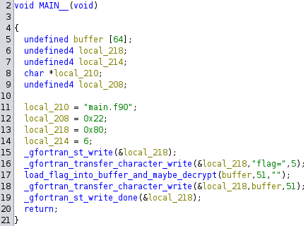
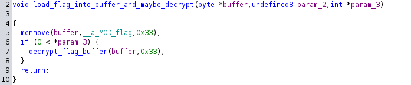
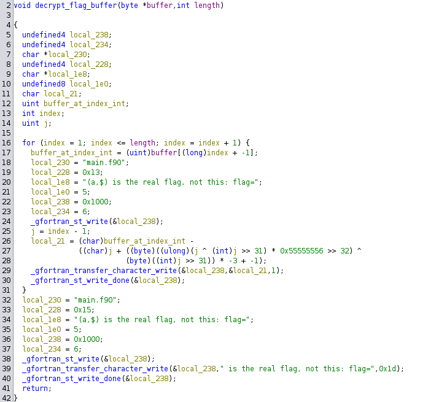
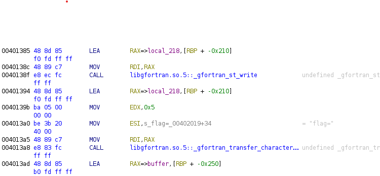
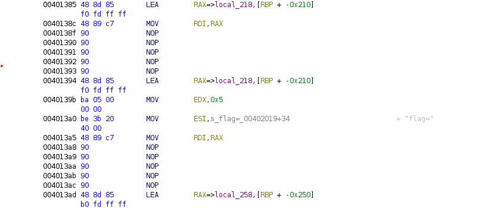
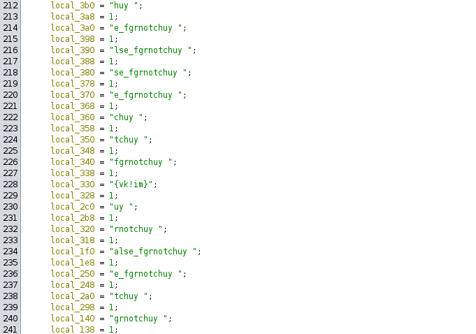
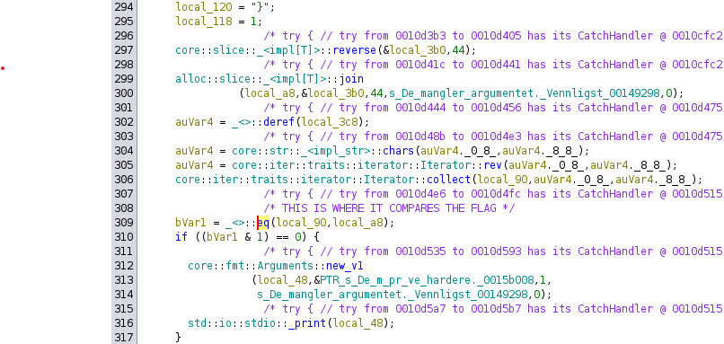

# HelseCTF 2024

# Innholdsfortegnelse

TODO


# matte og krypto

## alder

Flagg: `helsectf{4178279_1044566}`

### Oppgave

> Kari og Ola er to gamle vampyrer.
> 
> I dag er Kari 3133713 år eldre enn Ola. Om 5 år vil Kari være 4 ganger eldre
> enn Ola. Hvor gammel er Kari og Ola i dag?
> 
> Flaggformat: `helsectf{<alder kari>_<alder ola>}`
> 
> Som eksempel, hvis Kari er 1 år og Ola er 3 år så ville svaret vært
> `helsectf{1_3}`. Merk at dette bare var et eksempel for å vise deg hvordan du
> leverer når du har riktig svar.

### Løsning

Setter opp likningsett og løser for de to ukjente. La `k` og `o` være alderen
til hhv. Kari og Ola i dag. Teksten skrives derfor som følgende likninger, og
løses.

```
(1) k = o + 3133713
(2) k + 5 = 4*(o + 5)

(1)->(2)
o + 311713 + 5 = 4*o + 20
3*o = 3133698

=> o = 1044566
=> k = 1044566 + 3133713 = 4178279
```


## reisetid

Flagg: `helsectf{1415_112500}`

### Oppgave

> Kari og Ola bor 150km fra hverandre og skal møtes for å ta en kaffe. Kari
> kjører kl 1200, og ville brukt 3 timer om hun måtte kjøre hele lengden på
> 150km. Ola kjører kl 1300, og ville brukt 5 timer om han måtte kjøre hele
> lengden på 150km.
> 
> Hva er klokka når de møtes, og hvor langt i meter har Kari kjørt?
> 
> Flaggformat: `helsectf{<tid 4tall>_<lengde i meter>}`
> 
> Som eksempel, hvis de møtes kl 1201 og Kari har kjørt 11km så vil svaret være
> `1201_11000`. Merk at dette bare var et eksempel for å vise deg hvordan du
> leverer når du har riktig svar.

### Løsning

Gjør teksten om til et likningsett og løser for posisjon. Vi setter kl 12:00 som
nullpunkt, altså `t_0 = 12:00`, så Kari starter å kjøre på `t = 0`, mens Ola
starter å kjøre på `t = 1`. Videre ved vi at Kari har en snittfart på `v_k = 50
km/h` mens Ola har en snittfart på `v_o = 30 km/h`. Posisjonene deres på tid `t`
er gitt ved likningene

```
(1) s_k = v_k * t
(2) s_o = 150 - v_o * (t - 1)
```

Hvis vi sett dem lik hverandre og løser for `t` får vi at de møtes ved `t =
2.25` timer, altså etter **2 timer og 15 minutter**, altså kl 14:15. Vi finner
så at Kari har kjørt

```
s_k = 50 km/h * 2.25 h = 112.5 km = 112 500 m
```

så da har vi alle delene av flagget.


## Larsw sekvens

Flagg: `helsectf{0mG!__deBruiJn!}`

### Oppgave

> Vi har fanget opp en spesiell sekvens
> `AAABAACAADAAEAAFAAGAAHAAIAAJAAKAALAAMAANAAOAAPAAQAARAASAATAAUAAVAAWAAXAAYAAZAAaAAbAAcAAdAAeAAfAAgAAhAAiAAjAAkAAlAAmAAnAAoAApAAqAA`
> med en liste av korte tegn:
> 
>     AjAA
>     AiAA
>     kAAl
>     AAnA
>     AiAA
>     hAAi
>     AnAA
>     iAAj
>     pAAq
>     QAAR
>     AAlA
>     AYAA
>     LAAM
>     AgAA
>     AgAA
>     AAiA
>     AiAA
>     WAAX
>     mAAn
>     nAAo
>     jAAk
>     AZAA
>     AlAA
>     LAAM
>     AqAA
> 
> Kameraten til Lars sier at han kan ha brukt dette til å kryptere flagget. Lars
> har muligens en overdreven interesse i sekvenser laget av Nicolaas Govert.

### Løsning

Nicolaas Govert de Bruijn er kjent for [de Bruijn
sekvenser](https://www.baeldung.com/cs/de-bruijn-sequence) som har alle mulige
substrenger inni seg. Den lange sekvensen ser ut til å være en de Bruijn
sekvens. Vi kan finne `AjAA` i den, så da er det rimelig å tro at hver korte
streng er et tegn i flagget. Det viser seg at `AjAA` starter på indeks 104 som
tilsvarer ASCII `h`. Med denne kunnskapet kan vi lage følgende solve script:

```python
de_bruijn = \
"AAABAACAADAAEAAFAAGAAHAAIAAJAAKAALAAMAANAAOAAPAAQAARAASAATAAUAAVAAWAAXAAYAAZAAaAAbAAcAAdAAeAAfAAgAAhAAiAAjAAkAAlAAmAAnAAoAApAAqAA"

seq_list = [ "AjAA", "AiAA", "kAAl", "AAnA", "AiAA", "hAAi", "AnAA", "iAAj",
            "pAAq", "QAAR", "AAlA", "AYAA", "LAAM", "AgAA", "AgAA", "AAiA",
            "AiAA", "WAAX", "mAAn", "nAAo", "jAAk", "AZAA", "AlAA", "LAAM",
            "AqAA"]

flag = []
for seq in seq_list:
    i = de_bruijn.find(seq)
    flag.append(i)

flag = "".join(chr(i) for i in flag)
print(flag)
```

## joppe1

Flagg: `helsectf{ved_x_null_er_alt_gull}`

### Oppgave

> Redd Joppe, død eller levende!
> 
> Ola har en lei tendens til å miste muldvarpen sin, Joppe. Denne gangen er den
> blitt kidnappet av Adi Shamir og hans venner. Adi har låst den inn i safen med
> en kode som ingen helt vet.
> 
> De tre vennene har delt koden mellom seg på en slik måte at du trenger to av
> bitene for å kunne rekonstruere koden til safen.
> 
> De går med på å gi deg sin bit hvis du kan løse deres gåte.
> 
> Bruk endepunktet under for å prøve deg på gåtene.
> 
> Om du bruker du Adis metode eller ikke så finner du koden på null.

### Løsning

Vi kobler til URLen og blir bedt om å løse noen gåter. 

1. De fattige har det, de rike trenger det, og hvis du spiser det, dør du. Hva
   er det?
    - Svar: ingenting
    - Hemmelighet: `(-500, 1229)`
2. En bussjåfør kom nedover en gate. Han suste rett forbi et stoppskilt, uten å
   stoppe. Han tok til venstre der det var innkjøring forbudt. Han passerte en
   politibil på feil side av gata. Likevel brøt han ikke en eneste
   trafikkregel. Hvordan kunne det ha seg?
    - Svar: ???
3. Hva blir våtere jo mer den tørker?
    - Svar: håndkle
    - Hemmelighet: `(1000, 2729)`

Googler Adi Shamir og finner [Shamir's secret
sharing](https://en.wikipedia.org/wiki/Shamir%27s_secret_sharing). Wikipedia har
et bra eksempel på rekonstruksjon, så jeg følger samme fremgangsmåte med
hemmelighetene over, og finner at koden er `1729`. Når jeg sender det inn får
jeg flagget. 

Etter å ha løst `joppe2` hadde jeg skrevet kode for å løse Shamir's Secret
Sharing, så jeg tilpasset koden til `joppe1`. Se
[`joppe1/solve.py`](./matte_og_krypto/joppe1/solve.py). 


## joppe2

Flagg: `helsectf{muldvarp_er_bra}`

### Oppgave

> Redd Joppe, død eller levende!
> 
> Joppe er igjen låst inn av Adis venner.
> 
> Denne gangen er koden delt slik at du trenger 3 av bitene fra gjengen på 5 for
> å finne koden til safen der Joppe ligger. Koden inneholder også flagget.
> 
> Det er ganske store tall, presisjonen må opp og Adi kan ha glemt å bruke
> modulo her.

### Løsning

Kobler til URLen og løser gåtene:

1. Æ e ", å [ er lik, ka e æ?
    - Svar: ???
2. Hvis 'away away away' er klokka 3. Hva er 'come bye'?
    - Svar: klokka 7
    - Hemmelighet: `(2588682506107567,
      655305480793967733879479427128553132958736140573542016023878)`
3. Don't worry, be happy. Etter I kommer ii, men hva følger?
    - Svar: ???
4. Hvem er det som er sønn av mine foreldre, men likevel ikke min bror?
    - Svar: meg selv
    - Hemmelighet: `(4359708773407619,
      655305480794013934214261797861718778141983069985929089695418)`
5. Hva er ditt, men blir likevel brukt mest av andre?
    - Svar: navnet ditt
    - Hemmelighet: `(6634057562378419,
      655305480794107806938926839990618969191800755240410150653418)`

Her skal vi også løse Shamir's Secret Sharing, men utfordingen er at vi har 
store tall. Hvis vi bruker Lagrange basis polynom for å gjøre interpoleringen
som løser SSS er vi nødt til å bruke flyttall, og da får vi ikke rett presisjon.
Løsningen er å gjøre det kun med ints fordi int i Python kan ha vilkårlig
presisjon. 

Siden vi vet at vi kun trenger 3 hemmeligheter løser jeg det for hånd. Jeg
setter opp polynom-funksjonen `f(x) = y0 * l0(x) + y1 * l1(x) + y2 * l2(x)` der
`li(x)` er Lagrange-polynomene, og løser ut til jeg har `[produkt] * f(x) = [sum
av produkt]` ved å gange med felles nevner og forenkle. Slik unngår vi brøker
som leder til flyttall. Deretter er det bare å evaluere på `x = 0` og
heltallsdividere med produktet på venstre siden for å få koden. Til slutt gjør
jeg koden om til bytes og finner flagget. Under er et Python-program for å løse
dette. 

```python
from Crypto.Util.number import long_to_bytes

def reconstruct(secret0: tuple[int, int],
                secret1: tuple[int, int],
                secret2: tuple[int, int]):
    x0, y0 = secret0
    x1, y1 = secret1
    x2, y2 = secret2

    # We can't use floating points as we lose precision, but ints in Python
    # have arbitrary precision, so we do all calculations using ints.
    # The formulas has been manually manipulated on paper to end up at the ones
    # below.
    prod = (x0 - x1) * (x0 - x2) * (x1 - x2)

    f_prod = lambda x: y0 * (x - x1) * (x - x2) * (x1 - x2) -\
                       y1 * (x - x0) * (x - x2) * (x0 - x2) +\
                       y2 * (x - x0) * (x - x1) * (x0 - x1)

    eval0 = f_prod(0)
    assert eval0 % prod == 0, "Modulo test failed"
    f0 = eval0 // prod
    return f0


secret2 = (2588682506107567, 655305480793967733879479427128553132958736140573542016023878)
secret4 = (4359708773407619, 655305480794013934214261797861718778141983069985929089695418)
secret5 = (6634057562378419, 655305480794107806938926839990618969191800755240410150653418)
joppe2 = reconstruct(secret2, secret4, secret5)
print(long_to_bytes(joppe2).decode())
```


## joppe3

### Oppgave

> Redd Joppe, død eller levende!
> 
> Koden blir igjen delt opp mellom de 5 og man må løse minst 3 oppgaver for å
> finne koden til låsen.
> 
> Men denne gangen hadde Adi sovet dårlig, og noe gikk galt. Presisjonen på
> tallflytsoperasjonene ble noe unøyaktig, også mumlet Adi noe om at "finner du
> x, finner du koden".
> 
> Igjen er det ganske store tall, presisjonen må opp og Adi har igjen glemt å
> bruke modulo her.

### Notater

Jeg klarte ikke å løse denne. Under er løsningen på alle gåtene samt
hemmelighetene: 

1. Hva er det dine barn må gi deg som du ikke kan få selv?
    - Svar: barnebarn
    - Hemmelighet: `(2344332245,
      65530548079400370318528292311996782073761367365025193477153)`
2. Noen måneder har 30 dager og noen har 31 dager. Hvor mange måneder har 28
dager?
    - Svar: alle
    - Hemmelighet: `(13429121073,
      362422730191176971056722614457277134831341186224587467857920)`
3. Du kommer til en kald vinterhytte og oppdager at du kun har en fyrstikk. I
   hytta er det en peis, en parafinlampe og ett stearinlys. Hva tenner du først?
    - Svar: fyrstikken
    - Hemmelighet: `(3429121073,
      95529569869860840087763619573109073266430740016361100443349)`
4. Livet mitt kan måles i timer, jeg tjener ved å bli slukt. Tynn, jeg er rask.
   Feit, jeg er treg. Vind er min fiende. Hva er jeg?
    - stearinlys
    - Hemmelighet: `(23429121073,
      611905828855656382575774271667026570700762200408325616089780)`
5. De har ikke kjøtt, fjær eller bein. Likevel har de fingre og tommel. Hva er
   de?
    - Svar: hansker
    - Hemmelighet: `(267429121073,
      1304263530048391400503348909036069075396369750743127072608747)`


## Kontraktsignering

Flagg: `helsectf{naar_man_jobber_med_krypto_b0r_man_vite_hva_man_gj0r}`

## Oppgave

> Signaturtjenesten 2OpphøydIe signerer alle dine meldinger, bortsett fra den
> superviktige kontrakten.
> 
> Alle som har riktig signatur på kontrakten får flagget!

Vedlegg: 
- [`source.py`](./matte_og_krypto/kontraktsignering/source.py)

## Løsning

Her skal vi gi rett RSA-signatur på en kjent streng. Utgitt kode viser at den
signerer meldinger med vanlig RSA-signering, men uten å hashe meldingen. Dette
gjør metoden sårbar til et bestemt angrep som hintes til i navnet "2OpphøydIe".

Angrepet går ut på at siden vi kjenner meldingen kan vi gange den med `2^e` for
å få `2s`, og deretter dele på `2` for å få rett signatur. Det ser ut som dette:

```
s = m^d  mod N
m' = m * 2^e  mod N

s' = (m')^d  mod N
   = (m * 2^e)^e   mod N
   = m^d * 2^(ed)  mod N
   = s * 2  mod N

s = s' / 2
```

Jeg lagde et Python-script hvor jeg limer inn `N` fra tjenesten og så regner det
ut `s`: 

```python
from Crypto.Util.number import bytes_to_long, long_to_bytes
from binascii  import hexlify, unhexlify

e = 0x10001
N = int(input("N (int) = "))
print()

contract = b"Dette er en superviktig kontrakt for veeldig viktige ting med store ord og uforstaaelige kruseduller."
m = bytes_to_long(contract)

e2 = pow(2, e, N)
m2 = (m * e2) % N
print("m' (hex) =", hexlify(long_to_bytes(m2)).decode())
print()
print()

s2 = bytes_to_long(unhexlify(input("signature for m' (hex) = ")))
s = s2 // 2

print()
print("s (hex) =", hexlify(long_to_bytes(s)).decode())
```


# rev

## babyrev_fortran

Flagg: `helsectf{l3nGe_s1D3n_f01k_progaMMeR7e_i_Fortran_90}`

### Oppgave

> En babyrev husker gamle fortellinger fra sin bestefar som programmerte i et
> litt utdatert programmeringsspråk. Heldigvis kom det en senere revisjon på
> 90-tallet som er noe enklere å bruke.
> 
> Greier du å printet ut flagget i klartekst?

### Løsning

Jeg åpner binærfilen i Ghidra og går til `main`-funksjonen:



Funksjoner med prefiksen `_gfortran` er innebygde funksjoner for
standard-funksjoner i Fortran (f.eks. `WRITE`). Fra det jeg klarte å forstå må
Fortran først starte skriving (`st_write`) for så å overføre bytene som skal
skrives til skjermen (`transfer_character_write`), for å til slutt stoppes
(`st_write_done`). 

Går vi inn i funksjonen jeg har døpt `load_flag_into_buffer_and_maybe_decrypt`
ser vi:



Den kopierer flagget fra en global variabel `__a_MOD_flag`, og basert på siste
argument kjører den noe mer kode. Går vi videre inn i `decrypt_flag_buffer` ser
vi:



Funksjonen looper gjennom flagget og dekoder/dekrypterer det på linje 26-28. Jeg
prøvde først å lage en Python-script som gjorde samme dekoding, men fikk det
ikke til å fungere. 

Derfor løste jeg oppgaven dynamisk. Jeg åpnet binæren i GDB og satt en
breakpoint på if-setningen i `load_flag_info_buffer_any_maybe_decrypt`. Ved å
manuelt skippe instruskjonen for if-setningen fikk jeg kjørt
`decrypt_flag_buffer`, men her hang programmet seg. 

Min teori for hvorfor dette skjer er at `st_write` ble først kjørt i `main`, og
deretter igjen i `decrypt_flag_buffer` *uten* at `st_write_done` blir kjørt
først. I GDB så jeg at programmet henger fordi det venter på en mutex. 

Løsningen min ble å patche binæren med `hexedit` til å ikke kjøre `st_write` i
`main` ved å erstatte `call` instruksjonen med `nop` (`0x90`). Assembly-koden
gikk fra



til



Merk at adressene er de samme. Jeg gjorde samme patch med if-setningen. 

Når jeg nå kjører binærfilen blir flagget skrevet ut. Programmet får segfault,
men det skjer etter at flagget blir skrevet ut så det betyr ikke noe her. 


## babyrev_rust 

Flagg: `helsectf{rask_rust_rimer_relativt_riktig!}`

### Oppgave

> En babyrev er litt Rust(en) i programmering. Hen har programmet inn et flagg i
> kildekoden, kompilert det til en binærfil (se vedlagt fil) men har så greid å
> mistet kildekoden. Om hen bare hadde skrevet ned argumentet. Kan du finne
> flagget og levere det inn?
> 
> Reven har noen vage minner om at det kan være et par hint i filen som kan
> hjelpe en ivrig REverser i å finne flagget.

### Løsning

Jeg installerer Ghidra pluginen [GhidRust](https://github.com/DMaroo/GhidRust)
og åpner binærfilen i Ghidra. Der blir jeg møtt med klønete dekopilert
"Rust"/pseudo-C-kode som er vanskelig å forstå. Etter mye stirring, lesing om
reversing av Rust
([CheckPoint Research sin
artikkel](https://research.checkpoint.com/2023/rust-binary-analysis-feature-by-feature/)
synes jeg var hjelpsom), hjelp fra ChatGPT, og dekompilere små Rust-programmer
for å skjønne flyten, kom jeg frem til at programmet leser inn en streng fra
`argv` og tester om den strengen er lik flagget. Det er en del funksjoner som
kjøres som `reverse`, `join`, og `rev`, men jeg skjønner ikke hvordan disse
henger sammen. 

Problemet er her måten strenger lagres på i Rust. Alle strenger lagres som en
kontinuerlig blokk i minne som gjør at Ghidra ikke forstår hvor en streng
slutter og en annen starter. Pseudokoden ser også ganske uforståelig ut:



Jeg kom frem til at strengen sikkert er definert som et array av `char`, og at
dette blir oversatt til en variabel med en `char`/`string` og variabelen som
ligger rett etter i minne er lengden. F.eks. `local_3b0 = "h"` og `local_3a8 =
1` (etter betyr her lavere minneadresse). 

Her er det da to måter å gå frem. Enten manuelt sette sammen alle `local_XXX`
variabelene i rett rekkefølge basert på minneadressen, eller dynamisk. Jeg gir
for dynamisk. Etter flagget er definert kommer det en skjekk:



`local_a8` er resultatet av `join` og `local_90` er det vi skrev inn som
argument. Jeg åpner derfor binæren i GDB og setter et breakpoint på
`call`-instruksjonen til `_<>::eq`. Siden `local_a8` er andre argument til
funksjonen, vet vi at det lastes inn i `RSI`-registeret. Derfor kan vi skrive ut
innholdet i minnet der `RSI` peker, og dermed får vi flagget. 


## StateOfGo

Flagg: `helsectf{redeclaring_a_Go_variable_can_shadow_another!}`

### Oppgave

> Mitt Go-program kompilerer fint, men viser ikke flagget? Jeg som trodde Go
> aldri kunne gjøre noe feil!? Se om det hjelper å overskrive en byte på
> vilkårlig offset.

Vedlegg:
- [`server.py`](./rev/StateOfGo/server.py)

### Løsning

Vi får se en Go-kode som vi kan redigere ett tegn i og så kjøre koden. Full
kildekode til Go-progammet er:

```go
package main

import (
		"fmt"
		"os"
)

type N struct {
		data string
		i	 int
}

func (n N) get() string {
		return string(n.data[n.i])
}

func main() {
		flag, _ := os.ReadFile("flag.txt")
		n := N{string(flag), -1}
		t := func(n N) N {
				n.i += 1
				return n
		}
		for i := 0; i < len(n.data); i++ {
				n := t(n)
				fmt.Print(n.get())
		}
		fmt.Println()
}
```

Poenget her er å finne ut at det er forskjell mellom `:=` og `=`, der
førstnevnte deklarerer en ny variabel, mens sistnevnte tilegner en verdi til en
allerede definert variabel. Problemet er her at hver gang `n := t(n)` kjøres,
overskrives variabelen så vi mister informasjon. Vi ønsker derfor å endre `:=`
til `=` ved å skrive et mellomrom over kolonet.

Med litt prøving og feiling finner jeg at en offset på 299 bytes er rett. Ved å
overskrive `:` med et mellomrom fungerer programmet som planlagt, og vi får
skrevet ut flagget. 


## Seksjoneringsavdelingsdirektør Gustavsen

Flagg: `helsectf{eg_er_i_ein_seksjon_hr_Gustavsen}`

### Oppgave

> De jobber i feil seksjon, hr. Gustavsen!

Vedlegg:
- [`gustavsen`](./rev/Seksjoneringsavdelingsdirektør-Gustavsen/gustavsen)

### Løsning

Åpner først i Ghidra, men får feilmelding om at DWARF 5 ikke støttes. Åpner
derfor i IDA Free i stedet. IDA gir også finere disassembly, med mer info.

Jeg åpnet først binærfilen i Ghidra, men får en feilmelding om at DWARF 5 ikke
støttes, så jeg går for IDA Free i stedet. IDA gir forøvrig mer forståelig
disassembly som gjorde arbeidet lettere. 

Jeg leser gjennom koden og finner at den looper gjennom alle
ELF-seksjon-headerene og ser om den starter med den magiske verdien `EEFEAAFA`.
Dette er det eneste stedet noe skrives ut til skjermen, så det må være dette vi
finner flagget. Etter litt leting og debugging med GDB finner jeg at seksjonen
`.pewpew` starter med den rette magiske verdien. Problemet er at programmet
slutter etter å ha lest en slik seksjon, og hvis det kommer flere seksjoner
etter denne blir de ikke lest. 

Jeg søker etter den magiske verdien i hex view og ser jeg at en seksjon med
akkurat samme magiske verdi kommer rett etter `.pewpew`. Fra `readelf -S` ser
jeg at denne har navnet `.symdata`. Her ligger antakelig flagget, så jeg patcher
binærfilen med `hexedit` så `.pewpew` ikke lenger har rett magiske verdi, og da
får jeg printet flagget.


## debug_rat

### Oppgave

> En god RAT går aldri av moten! Vi har deployet en test, men glemte å slå av
> feilsøkingsgrensesnittet og andre skjulte kommandoer.
> 
> Kan du ta kontrollen på råtta og se om det er mulig å få ut flagget som ligger
> lagret på `/flag.txt`?
> 
> Oppdatering: Obs! Noen kan finne flagget på en måte som inneholder en feil -
> det har doble underscores '__'. Korrekt flagg er uten doble underscores.
> 
> PS! Binarien er en fult fungerende Remote Access Trojan som gir Remote Code
> Execution. I god stil er derfor oppgavefilen pakket i en kryptert zip.
> (passord: infected)

### Løsning


# maldoc

## easy_flag

Flagg: `helsectf{maldoc=malicious_document}`

### Oppgave

> Du har fått i oppgave å analysere et Excel-ark for å se om det kan inneholde
> en skjult melding.
> 
> I god stil er oppgavefilen pakket i en kryptert zip. (passord infected)

Vedlegg:
- [`easy_flag.zip`](./maldoc/easy_flag/easy_flag.zip)
    - [`easy_flag.xlsm`](./maldoc/easy_flag/easy_flag.xlsm)

### Løsning

Kjører `olevba` fra [`oletools`](https://github.com/decalage2/oletools) for å
lete etter VBA-makroer. Da dukker flagget opp som en variabel i en funksjon.  


## hidden

Flagg: `helsectf{usynlig_ark!}`

### Oppgave

> Enda et Excel-ark! Men denne gangen fant vi ingen macroer... Men hvor er
> flagget?
> 
> I god stil er oppgavefilen pakket i en kryptert zip. (passord infected)

Vedlegg:
- [`hidden.zip`](./maldoc/hidden/hidden.zip)
    - [`hidden.xlsm`](./maldoc/hidden/hidden.xlsm)

### Løsning

Her er det ingen makroer, så jeg åpner dokumentet i OpenOffice Calc. Det er
ingen åpenbare steder flagget er, men etter hvert finner jeg et skjult ark
"Sheet 1337". Jeg åpner det ved å navigere til `Format > Sheet > Hide`
[<sup>kilde</sup>](https://forum.openoffice.org/en/forum/viewtopic.php?t=90945)
og dekoder base64-strengen som ligger der. 


## Claim_in_mail

Flagg:
`helsectf{if_it_qaks_like_a_bot_6ebd7e86fa5a82fb062800f9529fede402ab4b758453ee1456197754ca051145}`

### Oppgave

> Du har fått en e-post med et html-vedlegg. Det er vel bare å åpne det?
> 
> Tips: Nøst opp i angrepskjeden. Finn ut hva den forsøker å kjøre. Målet er å
> finne siste tilgjengelig steg i kjeden.
> 
> I god stil er oppgavefilen pakket i en kryptert zip. (passord infected)

Vedlegg:
- [`Oppgave.zip`](./maldoc/claim_in_mail/Oppgave.zip)
    - [`Claim_3456.html`](./maldoc/claim_in_mail/Claim_3456.html)

### Løsning

Her får vi utlevert en html-fil som er starten på en kjede med mange lag som
ender i en .NET-fil som inneholder flagget. Under er en kort beskrivelse av
hvert lag.

1. HTML-filen inneholder base64-enkodet data av en SVG-fil. Kopierer
   base64-dataen til
   [`stage1/section.svg.b64`](./maldoc/claim_in_mail/stage1/section.svg.b64) og
   gjør den om til et svg-bilde. 
2. I svg-bildet er det embeddet noe JavaScript jeg kopierer til
   [`stage1/svg-embedded.js`](./maldoc/claim_in_mail/stage1/svg-embedded.js).
   Jeg rydder opp i denne og fjerner `window.location.assing` kallet. Dette
   gir en zip
   [`stage2/svg-embedded-output.zip`](./maldoc/claim_in_mail/stage2/svg-embedded-output.zip).
   I zip-filen ligger [`stage2/Claim_3456.vhd`]. 
3. VHD-filen er en virutell harddisk som kan mountes med `mount -o
   loop,offset=$((128*512)) ./Claim_3456.vhd ./Claim_3456`. Merk at dette ikke
   fungerer på WSL, men det fungerer på en Linux-VM i VirtualBox. Offsetten
   kommer av at hver sektor har størrelse 512 bytes, og første filsystem starter
   i 128. sektor (info fra `fdisk -l ./Claim_3456.vhd`). 
4. Filsystemet [`stage4/Claim_3456/`](./maldoc/claim_in_mail/stage4/Claim_3456/)
   har en `.lnk` fil som vi kan lese med scriptet
   [`lslnk.pl`](./maldoc/claim_in_mail/lslnk.pl). Da finner vi at den kjører
   scriptet
   [`respondents/ibidem.cmd`](./maldoc/claim_in_mail/stage4/Claim_3456/respondents/ibidem.cmd) 
   som igjen starter
   [`respondents/suspect.cmd`](./maldoc/claim_in_mail/stage4/Claim_3456/respondents/suspect.cmd) 
   som kjører `start crossbar.tmp run`. Jeg brukte en del tid på å prøve å
   reversere denne i Ghidra, men uten så mye fremgang. Jeg så flere steder
   referanser til `StringLibrary.dll` og konkluderte med at `crossbar.tmp` er en
   exe som kjører kode fra denne DLLen. 
5. Jeg åpner
   [`StringLibrary.dll`](./maldoc/claim_in_mail/stage4/Claim_3456/respondents/StringLibrary.dll)
   i [ILSpy](https://github.com/icsharpcode/ILSpy) og finner en funksjon
   `b64_decode`. Denne kjører først en base64 decode og deretter en
   XOR-dekryptering. Jeg skriver et Python-script som gjør det samme, og får
   endelig flagget.

```python
from base64 import b64decode

b64_str = "DAEIFwEHEAIfDQI7DRA7FQUPFzsIDQ8BOwU7BgsQO1IBBgBTAVxSAgVRBVxWAgZUUlZcVFQCXVFWXQIBAAFQVFYFBlAGU1FcUFFXAQFVUFFSVV1TU1FQBwVUUVVVUFEZ"

decoded = bytearray(b64decode(b64_str))
num = 5
num = (num * 2686 + 1432990190) % 256

for i in range(len(decoded)):
    decoded[i] ^= num

print(bytes(decoded).decode())
```


## Pass or fail?

Flagg: `helsectf{this_2_shall_pass}`

### Oppgave

> .bat - filer kan gjøre ganske mye. Denne bat-filen vil ikke kjøre noe skummelt
> om du kjører den. Finn ut hva den gjør. Evt hva du kan mate den med (input)
> for å få ønsket resultat.
> 
> Flagget gjemmer seg i en pass, ikke en fail.
> 
> Passord for zip-fil er standard (infected).

Vedlegg: 
- [`pass_or_fail.zip`](./maldoc/pass_or_fail/pass_or_fail.zip)
    - [`pass_or_fail.bat`](./maldoc/pass_or_fail/pass_or_fail.bat)

### Løsning

Bat-filen er obfuscated med masse rare tegn og variabel-substitusjoner. Jeg
begynte å manuelt løse opp substitusjonene, men det var tungvint arbeid. Jeg
visste heller ikke hva `public` variabelen var satt til. Jeg endte med å bare
kjøre .bat filen i stedet. Første linje ser vi åpenbart er `@echo off`, så denne
kommenterte jeg ut for at kommandoene skulle skrives til skjermen. Et triks vi
kan bruke for å skrive ut alle kommandoene uten å kjøre dem er å legge til `rem`
foran hver linje. Da vil den løse opp alle substitusjonene, men ikke kjøre
kommandoene. For at det skal fungere, må vi først gjøre alle de kinesiske
tegnene om til vanlig ASCII. Dette gjør jeg manuelt med Search and Replace. Jeg
vet også at bat-filen leser inn et argument, så etter å ha renset litt opp
kjører jeg `pass_or_fail.bat ARG1`.

```dosbatch
@echo off
set "a=wrUnsT7NBeCfiljYRb5cPF2oQ8SWZzG@VJpvXxO6K3HI LadgAqDmu14h=MEkty09"
@set "b=Kt@4oE2uzLIZ80qiR1YpOldD SjNe7bWskfvUMCwVBnrGgFHamPJhxXAyQ536c9=T"
@set "c=ybVIQN=SoEOikuHCcfao LhB3KUA6rzXxY0Dw7nJg4sM9tjG85d1ZqePlWRv@FTpm"
@set "d=NaY35kTOpHZ@oE0hI=yrxjm SUbKF6eiCW7R9fslt8wJuzdoDLA1Gv4nQgMXVPcBq"
@set "e=RzxkNpCdKhS3@oefquTcowElvU8W9rLHVa 6AZDG7Q0Yy5JijnFO4MPbgXmBtI1s="
for /l %y in (1,1,1) do @echo off
if 1 EQU 1 set "abco=https://youtu.be/YZf0Q-v3u-k?feature=6e65697468657oo069732074686973"
for /l %y in (1,1,1) do set "abc3=https://youtu.be/3xYXUeSmb-Y?feature=54686973o06973206e6f74o0746865o0666c6167"
if 46 EQU 0 (@exit) else set "abc4=G@nd@lf"
if 1 EQU 1 set "abc1=https://youtu.be/qybUFnY7Y8w?feature="
if 1 LsS 109 set "abc7=explorer.exe"
if 1 EQU 1 if not "ARG1" equ "" goto usage
for /l %y in (1,1,1) do goto end
:usag^e  lli^iliiilil   l^lililllili
if 1 LsS 109 set "abc5=68656c73656374667b746869"
if 1 LsS 109 if ARG1==G@nd@lf (set "abc6=735f3o5f7368616c6c5f706173737d"
if 1 LsS 109 set "abc7=https://youtu.be/qybUFnY7Y8w?feature=68656c73656374667b746869735f3o5f7368616c6c5f706173737d"
) else (start )
if 1 LsS 109 start explorer.exe
if 1 LsS 109 exit
:en^d  lilll^illill   liillllll^il
for /l %y in (1,1,1) do start https://youtu.be/3xYXUeSmb-Y?feature=54686973o06973o06e6f74o0746865o0666c6167
```

Vi ser flere YouTube-linker, og noe som likner på hex-enkodet ASCII etter
`?feature=` i URLene. Det er derimot en `o` (liten O) flere steder i strengene
så de er ikke direkte konverterbare enda.

Hvis vi ser på `54686973o06973o06e6f74o0746865o0666c6167` og sletter `o0`-ene,
får vi `Thisisnottheflag`. Det tyder på at `o0` burde være `20` (altså
mellomrom), så da antar jeg at `o = 2`.

Tar vi den andre hex-strengen og endrer `o` til 2, får vi flagget:

```python
>>> binascii.unhexlify("68656c73656374667b746869735f3o5f7368616c6c5f706173737d".replace("o","2"))
b'helsectf{this_2_shall_pass}'
```


# misc

## Skalerbar vektorgrafikk

Flagg: `helsectf{gjemt_flagg}`

### Oppgave

> Flagget finnes i den vedlagte SVG-fila.

### Løsning

I svg-koden er det en linje som skiller seg ut ved å ha definert
`style="fill:#000"`. Ved å kommentere ut denne viser flagget seg. 


## tetris1

Flagg: `helsectf{tetromino}`

### Oppgave

> I denne runden av HelseCTF har vi laget vårt eget tetris-spill. Spill tetris
> til du har fått rydda bort totalt fem linjer.

Vedlegg:
- [`tetris.html`](./misc/tetris/tetris.html)

### Løsning

Spiller bare Tetris til jeg rydder 5 linjer. 


## tetris2

Flagg: `helsectf{meisebolle}`

### Oppgave

> Før du starter spillet står det hvilke taster som kan brukes for å styre
> spillet. Én av tastene er ikke listet og gir uante muligheter. Bruk tasten mye
> og få et flagg.

### Løsning

Ser at pil opp ikke er listet som en tast man kan bruke. Litt tilfelding finner
jeg at hvis man trykker inn pil opp nært bunn går tetrominoen opp en linje. Hvis
man fortsetter å holde inne går tetrominoen helt opp og ut av brettet. Da dukker
flagget opp.


## tetris3 

Flagg: `helsectf{himmelferd}`

### Oppgave

> Nede i horisonten, under fjell, snø og terreng ligger det et flagg.

### Løsning

Jeg har tatt ut JavaScript-koden fra HTML-filen til en egen fil og beautifyet
den, se [`tetris.js`](./misc/tetris/tetris.js).  

I `drawFrame` funksjonen er det separate funksjoner for å tegne himmel, terreng,
brett, og fugler. Siden vi skal lete "nede i horisonten, under fjell, snø og
terreng", kommenterer jeg bort `drawTerrain` og flagget dukker opp.


## tetris4

Flagg: `helsectf{nocheat}`

### Oppgave

> Spill til du har fått renska 5000 linjer på brettet.

### Løsning

Hvis man prøver å naivt sette antall linjer til mer enn 5000 får vi opp en sint
ugle som sier "CHEATER". Denne dukker opp når `currentMode` ikke er en av de
forhåndsdefinerte verdiene, se `keyPressed`. Et par steder i koden settes
`currentMode = "CHEATER!"`, men det viser seg at flere steder i koden settes
variabelen også til kun *en* bokstav. Siden cheater vinduet dukker opp hvis
`currentMode` ikke er en av de vanlige veridene, betyr det at der `currentMode`
settes til noe uvanlig fungerer som en slags anti-cheat. Det er tre steder hvor
dette skjer, og de tre betingelsene er oppsummert som følger

```js
3 * nTetros < state[0]
3 * nTetros < lines
Math.abs(lines - state[0]) > 30
```

`state[0]` og `lines` er hvor mange linjer vi har fjernet, mens `nTetros` er
hvor mange tetrominos som har blitt spilt (tror jeg). For å bekjempe
anti-cheaten må vi regne ut fornuftige verdier av disse tre variablene. Hvis vi
setter `state[0] = lines = 5001` må `nTetros = 1667`. Jeg definerer disse
verdiene i toppen av filen, og flagget dukker opp når siden lastes.


## bombzip2

Flagg: `helsectf{b0mb3rm4n_s3nt_y0u_a_fl4g}`

### Oppgave

> Vi har en bzip2-fil som inneholder et komprimert flagg, men den utpakka fila
> er kjempestor. Mange, mange terabyte, og flagget ligger helt på slutten. Hvis
> du prøver å pakke den ut fyller du sannsynligvis harddiskene dine. Derfor er
> oppgaven uløselig.

Vedlegg:
- [`flag.bz2`](./misc/bombzip2/flag.bz2)

### Løsning

Jeg prøvde først med en naiv `bzgrep helsectf flag.bz2`, men etter å ha kjørt
hele natten skjønte jeg at dette ikke var måten å gjøre det på.

Ved å se på `hexdump -C flag.bz2` ser vi mange repeterende blokker, og én ulik
blokk på slutten. Fra oppgaveteksten er det sannsynlig at siste blokk er
flagget. Jeg skriver et python-script hvor jeg kopierer fra hexdump for å lage
en fil med kun flagg-bytene, se
[`fail-solve.py`](./misc/bombzip2/fail-solve.py). 

Problemet er nå at `flag-block-only.bz2` ikke har rett checksum. Programmet
`bzip2recover` skriver hver blokk til en egen fil, så jeg bruker dette for å få
ut blokken, som da kan brukes til å få flagget med `bzcat
rec00001flag-block-only.bz2`. Merk at den resulterende filen er fortsatt 12M
stor, fylt nesten kun av `0x00`, men bash ignorerer disse når det skrives ut i
terminalen.


## null pointer

Flagg: `helsectf{z3r0_p0inters_g1ven}`

### Oppgave

> Utvikler Per Ointer trenger av og til å kjøre python-programmer på webserveren
> sin. Derfor har han laget en veldig enkel webtjeneste for å sende inn
> python-programmer og returnere output:
> 
> Eksempelkjøring av program: `curl 'http://server/?program=print(repr(repr))'`
> 
> For å hindre misbruk er kun 10 forskjellige tegn tillatt i python-programmet:
> `pointer(*)`
> 
> Dessverre viser det seg at dette ikke er godt nok. Hent ut flagget i fila `0`
> i current directory.

### Løsning

Etter lang stirring på [built-ins i
Python](https://docs.python.org/3/library/functions.html), samt mye prøving og
feiling, fant jeg til slutt frem til noe som fungerte.

Vi trenger strengen `'0'` for å åpne filen med det navnet. `int()` gir tallet
`0`, og med `repr(int())` for vi den ønskede strengen `'0'`.

Vi kan så åpne filen `open('0')`. Fil-objekter kan itereres over i Python, og
`iter` hjelper oss der. `iter` returnerer derimot et iterator-objekt, så for å
gå gjennom generatoren kan vi bruke `*` for å "unpacke" iteratoren. Altså, vi
kjører `*iter(open('0'))`. Dette printer vi med `print`.

Det betyr at fullstendig program er:

```python
print(*iter(open(repr(int()))))
```


## not cipher

Flagg: `helsectf{lange_programmer_lever_lengst}`

### Oppgave

> Utvikler Carl I. Pher trenger av og til å kjøre python-programmer på
> webserveren sin. Derfor har han laget en veldig enkel webtjeneste for å sende
> inn python-programmer og returnere output:
> 
> Eksempelkjøring av program: `curl 'http://server/?program=print(repr(repr))'`
> 
> For å hindre misbruk er kun 13 forskjellige tegn tillatt i python-programmet:
> `not+cipher(*)`
> 
> Dessverre viser det seg at dette ikke er godt nok. Hent ut flagget i
> `/lol/hemmeligmappe/flagg.txt`

### Løsning

Her var trikset å bygge opp ASCII-verdiene for tegnene i filbanen til flagget.
Dette kan vi gjøre ved å innse at `0^0 = 1`, og at vi kan få dette ved å kjøre
`int()**int()`. Deretter kan vi summere sammen dette nok ganger til vi oppnår
rett verdi, og deretter wrappe alt med `chr(...)`. Hver `chr(...)` kan vi legge
sammen til en komplett streng, som vi så sender til samme payload som `null
pointer`. Dette gir flagget for `not cipher`. 

Mitt første utkast var på rundt 93 000 bytes, og alt for lang for `short not
cipher` hvor vi har maks 5 000 bytes. Jeg har jobbet mye med å prøve å kutte ned
på antall bytes, men kommer ikke under ~5 800. Forsøket mitt ligger i
[`not-cipher/solve.py´](./misc/not-cipher/solve.py). Kortversjonen av hvordan
det fungerer er som følger.

Hvert ASCII-tegn har en hex-verdi `0xXY` som i base 10 betyr `X * 16 + Y`. Ved å
definere korteste formulering for tallene 0-16 (`n0` til `n16` i scriptet) kan
vi bygge opp samme ASCII-verdi som de lange summene over som vi sender inn i
`chr(...)`. Dette gir god forbedring, men ikke nok. 


# stego

## image processing 1 

Flagg: `helsectf{krokodille}`

### Oppgave

> fourier-transformasjoner kan brukes til mye innenfor bildeprosessering. man
> kan lett beregne en diskret fourier-transformasjon til et bilde i python:
> 
>     ft = numpy.fft.fft2(img_data)
> 
> en vanlig måte å visualisere en kompleks fourier transformasjon på er å skyve
> den slik at origo, og de laveste frekvensene havner i midten av
> visualiseringen. for å visualisere komplekse tall i vanlige grå-farger tar man
> gjerne normen / absoluttverdien til de komplekse verdiene. det er også vanlig
> å visualisere det med en logaritmisk skala, siden endringene i
> frekvens-intensiteten ofte er numerisk liten:
> 
>     fshift = numpy.fft.fftshift(ft)
>     spectrum = numpy.log(numpy.abs(fshift))
> 
> hva skjuler seg i dette bildet av et ekorn?

Vedlegg:
- [`ekorn.png`](./stego/image-processing-1/ekorn.png)

### Løsning

Kopierer koden fra oppgaven og plotter spektrumet som et bilde. Det resulterende
bildet [`flag.png`](./stego/image-processing-1/flag.png) viser flagget. 

```python
import numpy as np
import matplotlib.pyplot as plt

img_data = plt.imread("./ekorn.png")
ft = np.fft.fft2(img_data)
fshift = np.fft.fftshift(ft)
spectrum = np.log(np.abs(fshift))

plt.figure()
plt.imshow(spectrum)
plt.savefig("flag.png")
```


## image processing 2 

Flagg: `helsectf{pepperoni}`

### Oppgave

> fourier-transformasjonen til et bilde kan brukes til mye nyttig, blant annet
> til edge-detection. et high-pass filter vil slippe gjennom høye frekvenser,
> men stoppe lave frekvenser. de lave frekvensene beskriver de store og grove
> detaljene i bildet, mens de høye frekvensene beskriver små detaljer og harde
> linjer, teksturer og hår f.eks.
> 
> ved å fjerne de lave frekvensene kan vi lettere se de høye frekvensene og
> kanter og detaljer kommer bedre fram.
> 
> jeg har lagt ved et bilde av et blåbær, men det er dessverre nokså skadet og
> ting har glidd litt sammen, så det er umulig å se detaljene i bildet. se om du
> klarer å få frem noen detaljer!
> 
> tips! prøv gjerne litt forskjellige masker med forskjellige verdier.

Vedlegg:
- [`blabr.png`](./stego/image-processing-2/blabr.png)

### Løsning

Høypass-filter får frem kanter i bildet og tekst er laget av kanter, bruker jeg
det. Jeg får ChatGPT til å gi meg koden for å regne ut høypass-filteret av et
bilde, og prøver litt ulike verdier. Resultatet ser du i
[`flag.png`](./stego/image-processing-2/flag.png), hvor vi ser flagget. 

```python
import numpy as np
import matplotlib.pyplot as plt
from scipy.fft import fft2, ifft2, fftshift, ifftshift

# Thanks ChatGPT
def high_pass_filter_image(image, cutoff_frequency):
    fft_result = fft2(image)
    fft_shifted = fftshift(fft_result)
    rows, cols = image.shape
    mask = np.zeros((rows, cols))
    center = (rows // 2, cols // 2)
    x, y = np.ogrid[:rows, :cols]
    mask_area = (x - center[0]) ** 2 + (y - center[1]) ** 2 >= (cutoff_frequency ** 2)
    mask[mask_area] = 1
    fft_filtered = fft_shifted * mask
    filtered_image = ifft2(ifftshift(fft_filtered))

    return np.abs(np.array(filtered_image))


img_data = plt.imread("./blabr.png")
processed = high_pass_filter_image(img_data, 15)

plt.figure()
plt.imshow(processed)
plt.savefig("flag.png")
```


## prikker

Flagg: `helsectf{en_prikk_kan_ha_mange_farger!}`

### Oppgave

> En TV skjerm har klikket helt og viser bare prikker i ulike farger. Hvis man
> ser godt etter kan man kanskje se en hemmelig melding, spesielt hvis man
> finner den riktige fargen!

Vedlegg:
- [`prikker.zip`](./stego/prikker/prikker.zip)
    - [`prikker.gif`](./stego/prikker/prikker.gif)

### Løsning

Gifen vi får utlevert viser 4000 frames på 0.01 sekund. Når jeg åpner den ser
jeg mange prikker i ulike farger blinke på skjermen. Basert på oppgaveteksten
mistenker jeg at prikkene staver flagget. 

Jeg ser at de rød prikkene er minst, og gjetter på at det er disse prikkene jeg
er interessert i. Jeg skriver et Python-script som finner alle frames med røde
prikker og legger dem sammen:

```python
import numpy as np
import matplotlib.pyplot as plt
from PIL import Image, ImageSequence

gif_path = "./prikker.gif"

plt.figure(figsize=(10, 2))

target_color = [139, 0, 0]

accum = np.array([])
with Image.open(gif_path) as gif:
    for frame_number, frame in enumerate(ImageSequence.Iterator(gif)):
        frame = np.array(frame)
        if frame_number == 0:
            accum = np.zeros((*frame.shape, 3), dtype=frame.dtype)
            continue

        include = all(c in frame[:, :, i] for i, c in enumerate(target_color))
        if include:
            accum = accum + frame

plt.imshow(accum)
plt.title("Flag")
plt.savefig("flag.png")
```

Det resulterende bildet [`flag.png`](./stego/prikker/flag.png) viser flagget. 

