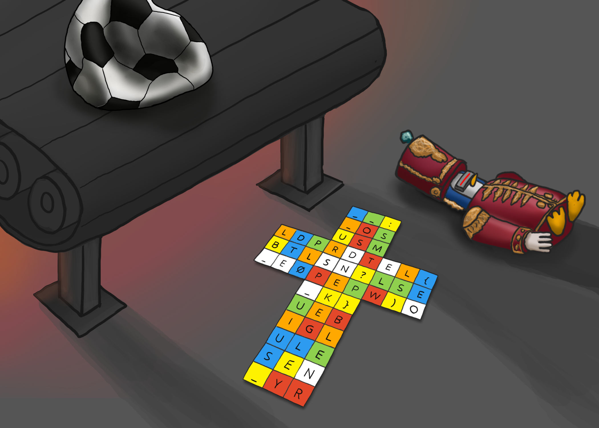
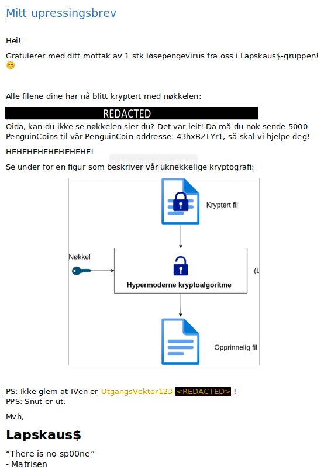
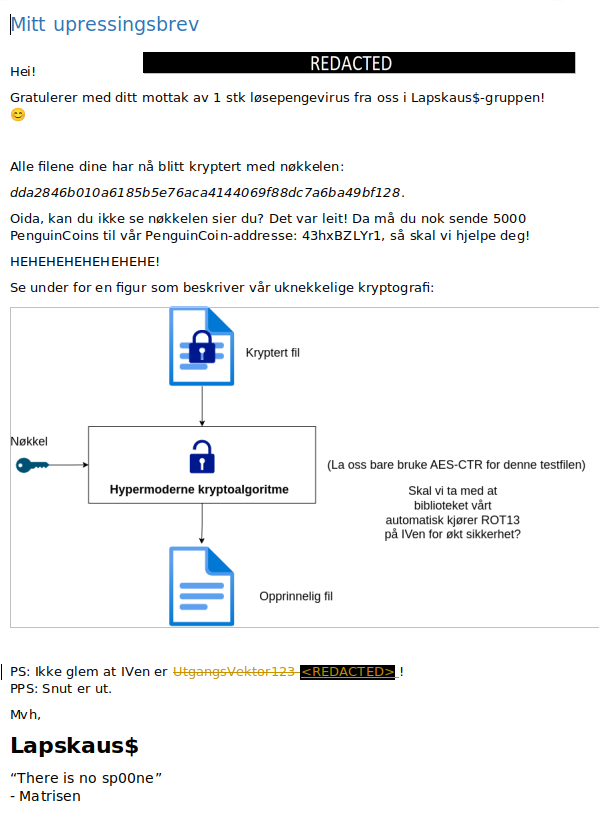
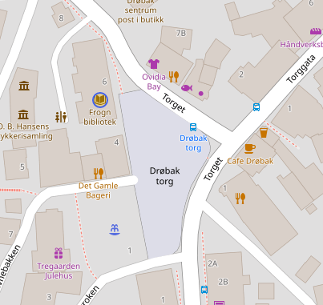
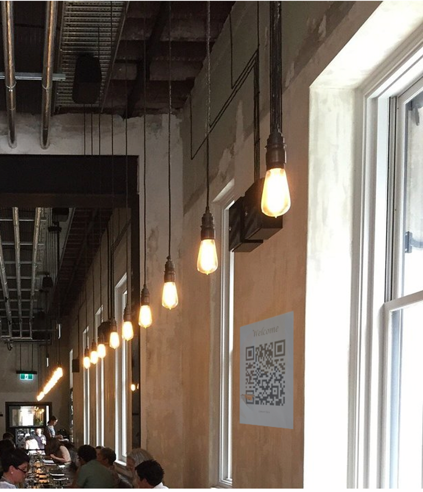

# NPST julen 2023

Dette var PSTs julekalender-CTF for julen 2023. I år var det i også i samarbeid
med NSM og Kripos. 


## Dag 1

### Flagg

`PST{SYSTEM INFISERT GRUNKER INCOMING}`


### Oppgave

> Mobil-detektiven 📱
> 
> ---
> 
> Her får du den første oppgaven!
> 
> Under etterforskningen av hendelsen på jule-verkstedet har vi oppdaget noe
> rart. Et av meldingssystemene som sender varslinger til beredskapsvaktene for
> verkstedet har sendt en SMS til et ukjent nummer. Meldingen er dessverre helt
> uleselig for oss, så vi trenger dine mobildetektiv-egenskaper. Når du finner
> ut av det, send meg svar på formatet PST{ditt svar her}.
> 
> ```
> 7-4 9-3 7-4 8-1 3-2 6-1 0-1
> 4-3 6-2 3-3 4-3 7-4 3-2 7-3
> 8-1 0-1 4-1 7-3 8-2 6-2 5-2
> 3-2 7-3 0-1 4-3 6-2 2-3 6-3
> 6-1 4-3 6-2 4-1
> ```
> 
> \- Tastefinger


### Løsning

Det var ikke umiddelbart åpenbart for meg hva tallene betydde. Etter å ha
stirret på dem en stund kan vi se at det første tallet er alltid i intervallet
0-9 og det andre tallet er maks 4. For de som husker tastaturet på gamle 
mobiltelefoner er dette kjent. Det er nemlig hvor mange ganger man må trykke på
hver tast for å få rett tall. `7-4` betyr altså "Trykk på knapp 7 fire ganger".
Dette kan løses med dette solve scriptet: 

[`solve.py`](./dag1/solve.py):

```python
sequence = "7-4 9-3 7-4 8-1 3-2 6-1 0-1 4-3 6-2 3-3 4-3 7-4 3-2 7-3 8-1 0-1 4-1 7-3 8-2 6-2 5-2 3-2 7-3 0-1 4-3 6-2 2-3 6-3 6-1 4-3 6-2 4-1"
sequence = sequence.split(" ")

keypad = {
    1: "", 2: "ABC", 3: "DEF",
    4: "GHI", 5: "JKL", 6: "MNO",
    7: "PQRS", 8: "TUV", 9: "WXYZ",
    0: " "
}

flag = "PST{"
for seq in sequence:
    num, idx = (int(i) for i in seq.split("-"))
    idx -= 1
    flag += keypad[num][idx]

flag += "}"
print(flag)
```


### Svar

> 🤦🏻
> \- Tastefinger


## Dag 2

### Flagg

`PST{LØSTE_DU_DENNE_SOM_PUSLESPILL_ELLER_KUBE?:)}`


### Oppgave

> Scrambled
> 
> ---
> 
> Over natten har det vært store utfordringer knyttet til en av maskinene i
> verkstedet. En serie feilproduserte leker har kommet på rullende bånd. Vi
> prøver å finne ut hva som har skjedd. Graver du ned i det her?
>
> \- Mellomleder

Vedlegg:




### Løsning

Fra vedlegget ser vi at vi har alle sidene til en Rubiks kube som er brettet ut
flatt, hvor hver firkant har en bokstav. Måten å løse oppgaven på er da å løse
Rubiks kuben slik at vi kan lese flagget på kuben. Det er flere måter å løse den
på. 

Den mest åpenbare måten er å løse den fysisk. Jeg gjorde opprinnelig dette,
men glemte å ta bilder av prosessen. Måten jeg gjorde det på var å først
overføre den flate kuben i en kube-løser nettside som f.eks.
[denne](https://rubiks-cube-solver.com/) hvor man kan tegne den flate kuben.
Deretter tok jeg å kjørte løsningen i revers for å få den rette kuben. Så var
det å klippe opp flere post-it-lapper og skrive bokstaver på dem, for så å løse
kuben og lese av.

En annen måte er å gjøre det manuelt i f.eks. Excel. Dette er mulig fordi hver
sub-kube i Rubiks kuben har kun én mulig plassering i en løst kube. F.eks. har
en hjørnebrikke med rød, blå og hvit kun ett rett sted i den løste kuben. Vi tar
derfor bokstavene fra den uløste kuben og overfører til de eneste stedene de
passer i en løst kube. Dette krever en del visualisering og hjernetrim, men det
går til slutt. Se [`solve.xlsx`](./dag2/solve.xlsx) for løsning. 

Etter å ha løst kuben ser vi at den rød siden sier hvilken rekkefølge vi skal
lese svaret i: `RBWGOY` = `red, blue, white, green, orange, yellow`. Dette gir
oss da flagget. 


### Svar

> Her var det mye røre! Bra du klarte å finne ut av det!
> 
> \- Mellomleder


## Dag 3

### Flagg

`KRIPOS{Husk å se etter spor i snøen!}`


### Oppgave

> 📃Redacted
> 
> ---
> 
> Det er krise! Filene på alvemaskinene har blitt kryptert, og vi har ingen
> backups tilgjengelig!
> 
> På nissens skrivebord fant vi det vedlagte brevet, sammen med en kryptert fil.
> 
> Det er ubeskrivelig viktig at vi får åpnet denne filen igjen umiddelbart, da
> Jule NISSEN ikke klarer å huske innholdet!
> 
> \- Mellomleder

Vedlegg:

* [Mitt utpressingsbrev.docx](<./dag3/Mitt utpressingsbrev.docx>)
* [huskeliste.txt.enc](./dag3/huskeliste.txt.enc)

### Løsning

Vi får utdelt et Word-dokument med en ransom-note:



Det er tilsynelatende "REDACTED", men dette er kun en svart boks vi lett kan
flytte. Det samme gjelder bildet midt på siden som viser krypto-metoden. Etter å
fikse disse figurene ser dokumentet slik ut:



Vi har dermed fått nøkkelen og krypteringsmetoden. Det modifiserte
Word-dokumentet får du [her](<./dag3/Mitt utpressingsbrev løst.docx>). 

For å dekryptere huskelisten lager vi et script som leser inn ciphertexten,
kjører ROT13 på IVen og dekrypterer med AES-CTR:

[`solve.py`](./dag3/solve.py):
```python
from pathlib import Path
from binascii import unhexlify
from Crypto.Cipher import AES
from Crypto.Util import Counter

def rot13(text):
    result = []
    for char in text:
        if "a" <= char <= "z":
            result.append(chr((ord(char) - ord("a") + 13) % 26 + ord("a")))
        elif "A" <= char <= "Z":
            result.append(chr((ord(char) - ord("A") + 13) % 26 + ord("A")))
        else:
            result.append(char)
    return "".join(result)


# 24 bytes = 192 bit key
key = unhexlify("dda2846b010a6185b5e76aca4144069f88dc7a6ba49bf128")

# IV is ROT13 encoded before use
iv = "UtgangsVektor123"
iv_rot13 = rot13(iv)

iv = iv_rot13.encode()

enc = Path("./huskeliste.txt.enc").read_bytes()

cipher = AES.new(
    key,
    AES.MODE_CTR,
    counter=Counter.new(128, initial_value=int.from_bytes(iv, byteorder="big"))
)

dec = cipher.decrypt(enc)

print(dec.decode("latin-1"))
```


### Svar

> Flott!
> 
> Jeg kaller inn til et møte med Jule NISSEN og de andre påvirkede så vi kan få
> delt ut informasjonen igjen.
> 
> \- Mellomleder


## Dag 4

### Flagg

`PST{ASCII_art_er_kult}`


### Oppgave

> Pinneved
>
> ---
> 
> Alvebetjentene på Jule NISSEN sitt verksted våknet i dag til et fryktelig syn;
> Julenissens slede er sprengt i fillebiter. Vi har satt folk på saken for å
> finne ut av hvem som er ansvarlig for ødeleggelsen, men det er kritisk at
> sleden blir reparert slik at vi får testet den før Jule NISSEN skal levere
> pakkene.
> 
> Alvebetjentene har samlet vrakrestene, samt verktøyet de mistenker at
> sabotørene har brukt.
> 
> Vi trenger at du rekonstruerer sleden så fort som mulig!
>
> \- Tastefinger

Vedlegg:

* [pinneved.py](./dag4/pinneved.py)
* [pinneved.txt](./dag4/pinneved.txt)


### Løsning

Dette er en reversing-oppgave hvor vi skal reversere `pinneved.py`-scriptet for
å rekonstruere sleden. Kort fortalt tar `pinneved.py`-scriptet den sammensatte
sleden og deler opp i 24 fragmenter med `explode()` funksjonen som lagres i
`bang`. Hvert tegn i hvert fragment blir så gjort om til det tegnet som kommer 2
etter som blir lagret i `eksplosjon`. Disse omgjorte fragmentene blir så satt
sammen ved å bruke indeksene i `otp` arrayet. Solve-scriptet under gjor denne
prosessen baklengs. 

[`solve.py`](./dag4/solve.py):
```python
from pathlib import Path

otp = [23, 2, 0, 5, 13, 16, 22, 7, 9, 4, 19, 21, 18, 10, 20, 11, 12, 14, 6, 1, 3, 8, 17, 15]
pinneved = Path("./pinneved.txt").read_text()

def explode(input, antall):
    størrelse = len(input) // antall
    fragmenter = []
    
    for i in range(0, len(input), størrelse):
        fragment = input[i:i+størrelse]
        fragmenter.append(fragment)
    
    return fragmenter

pinneved = explode(pinneved, 24)
pinneved_reversed = [""] * 24
for n, i in enumerate(reversed(otp)):
    pinneved_reversed[i] = pinneved[n]
eksplosjon = [
        ''.join([
            chr(ord(c) - 2) for c in fragment
        ]) 
        for fragment in pinneved_reversed
]
bang = "".join(eksplosjon)

Path("./slede.txt").write_text(bang)
print("Wrote answer to file slede.txt")
```

Den sammensatte sleden kan sees i [`slede.txt`](./dag4/slede.txt).


### Svar

> Et faktisk kunstverk! Godt jobbet!
> 
> Vi setter i gang testingen sporenstreks.
> 
> \- Tastefinger


## Dag 5

### Flagg

`PST{FROGN BIBLIOTEK}`


### Oppgave

> Muldvarpjakt
> 
> ---
> 
> Gjennom temmelig hemmelige innhentingsmetoder har vi fanget opp en melding om
> et nært forestående møte på Fastlands-Norge mellom en mistenkt kildefører som
> jobber for sydpolare tjenester og et ukjent objekt vi mistenker kan være en
> muldvarp.
> 
> For at våre spaningsalver skal settes i stand til å observere møtet og
> identifisere det ukjente objektet må vi vite hvor vi skal sende våre alver.
> 
> Vi prøvde å spørre OSINT-alvene våre, men de var travelt opptatt med å
> saumfare sosiale medier etter snille og slemme barn. De mumlet noe om at vi
> kunne fikse det selv med “turbo overgang”.
> 
> Kan du ut fra meldingen finne ut hvor de skal møtes?
> 
> > Ta bussen og gå av på holdeplassen rett ved begravelsesbyrået som ligger
> > inntil en sjømatbutikk. Jeg vil stå klar ved fontenen noen titalls meter fra
> > bussholdeplassen. Når du har kommet frem til fontenen, vil vi sammen gå til
> > det nærliggende biblioteket som ligger under 50 meter fra fontenen og
> > gjennomfører overføringen.
> 
> Svar meg med navnet på møtestedet og på formen PST{BERGEN LUFTHAVN}
> 
> \- Tastefinger


### Løsning

Dette er en OSINT-oppgave hvor vi skal lokalisere et sted basert på en
beskrivelse. Det er gitt et hint om at vi kan bruke "turbo overgang", altså
tjenesten [Overpass Turbo](https://overpass-turbo.eu/).

Vi ser nærmere på plassbeskrivelsen. Uthevelsene er mine:

> Ta bussen og gå av på **holdeplassen rett ved begravelsesbyrået** som ligger
> **inntil en sjømatbutikk**. Jeg vil stå klar ved **fontenen noen titalls meter
> fra bussholdeplassen**. Når du har kommet frem til fontenen, vil vi sammen gå
> til det **nærliggende biblioteket som ligger under 50 meter fra fontenen** og
> gjennomfører overføringen.

Basert på dette kan vi formulere den følgende Overpass Turbo queryen:

```
area[name="Norge"]->.no;                      
node(area.no)[shop="seafood"];                
node(around:10.0)[shop="funeral_directors"];  
node(around:100.0)[amenity="fountain"];       
node(around:50.0)[amenity="library"];         
                                              
out;                                          
```



Her har jeg ikke tatt med bussholdeplassen da jeg ikke visste hvordan, men det
viste seg å ikke være nødvendig. Den første linjen begrenser oss til
fastlands-Norge som spesifisert i oppgaven. De andre bruker filtre for å få
resultater som ligger nær de andre stedene. Dette gir kun ett resultat i Drøbak,
og vi finner dermed "Frogn bibliotek". 


### Svar

> Ypperlig! Nå har vi dem! :)
> 
> \- Tastefinger


## Dag 6

### Flagg

`PST{PepperkakerErMotbydelige}`


### Oppgave

> 🍪 KAKER-kontroll
> 
> ---
> 
> I en standard KAKER-kontroll (Kontroll Av Kommuniké med Eksport-Restriksjoner) har det blitt tatt en kopi av dette dokumentet. Vi syns det er snodig at akkurat denne personen har hatt med seg dokumentet siden personen har hatt anti-jul-holdninger tidligere, og vi vil derfor at du tar en nærmere kikk for å se etter uhumskheter.
> 
> \- Tastefinger
> 
> ```
> PE‍PPERKAKER {
>     POR‍SJONER {
>         20 kaker
>     }
>     ‍TYPE ‍{
>         julekake 
>     }
>     INGREDIENSER {
>         KAKEDEIG {
>             2 ts ‍Pepper
>             2 ts Malt ing‍efær
>             0,5 ts Malt nellik
>             3 dl Mørk siru‍p
>             300 g Smør
>             2 ts Malt kanel
>             4 ts Natron
>             2 stk. Egg
>             300 g Sukker
>             ca. 900 g Hvetemel
>         }
>         MELISGLASUR {
>             ca. 250 g Melis
>             1 stk. Eggehvite
>             0,5 ts Sitronsaft
>         }
>     }
>     OPPSKRIFT {
>         STEG1 { Bland smør, siru‍p og sukker i en kjele. Varm opp til sukkeret er sm‍eltet. Tilsett nellik, ingefæ‍r, pepper og kanel, og rør godt sammen. }
>         STEG2 { Ta ‍kjelen av platen og avkjøl bl‍andingen noe. Rør inn egg. }
>         STEG3 { Ha i natron, og si‍kt inn mel. Rør alt sammen til ‍en jevn deig. Deigen skal væ‍re ganske myk og klissete, den vil bli mye hardere når den blir kald! }
>         STEG4 { Hell deigen over i en bolle og dryss litt hvetemel på toppen. Dekk til med litt plastfolie og sett deigen kaldt noen timer, gjerne over natten. }
>         STEG5 { Skjær løs et stykke av deigen. Plasser resten av deigen tilbake i kjøleskapet. ‍Elt deigen forsiktig. Tilsett litt me‍r mel om den virker for myk. }
>         STEG6 { ‍Mel en flate, ‍og kjevle deigen ut til ca 3 mm tykkelse. Det er enklest når deigen er myk som plas‍tilina. Stikk ut pepperkakefigurer og flytt dem over på et ‍bakepapirkledd stekebrett. Samle restene av deigen og legg den kaldt. Skjær ut et n‍ytt stykke av ‍deigen og gjenta prosessen. Deigen blir vanskelig å jobbe med når den blir for varm, så da kan d‍en få hvile i kjøleskapet igjen. }
>         STEG7 { Stek kakene midt i stekeovnen på 175 °C i ca. 10 minutter. Avkjø‍l kakene helt på rist. }
>         STEG8 { Bland sammen mel‍is, eggehvite og sitronsaft til en tykk ‍glasur, og dekorer kaken‍e. }
>     ‍}
> }
> ```


### Løsning

Denne ble ganske enkel for meg for det første jeg gjorde etter å ha kopiert
pepperkakeoppskriften til en egen fil var å åpne den i Vim, og da kom det
tydelig frem at det var noen skulte tegn i teksten. Disse tegnene er [Unicode
`200d` - Zero Width Joiner (ZWJ)](https://www.compart.com/en/unicode/U+200D). Hvis vi
ser på den etterfølgende bokstaven for hver ZWJ ser vi at det staver starten på
flagget. Følgende solve script leser inn teksten og henter ut flagget.

[`solve.py`](./dag6/solve.py):
```python
import re
from pathlib import Path

text = Path("./input.txt").read_text().encode("utf-8")
special = b"\xE2\x80\x8d"  # https://www.compart.com/en/unicode/U+200D

flag = ""
for match in re.finditer(special, text):
    i = match.span()[1]
    flag += chr(text[i])

print(flag)
```

Merk at ZWJ har en annen byte-representasjon enn Unicode code point. 

### Svar

> Hvordan kan man ikke like pepperkaker?!
> 
> \- Tastefinger


## Dag 7

### Flagg

`NSM{af0dbd13cee45990593c182b213f978d}`


### Oppgave

> Alle gode ting er tre
> 
> ---
> 
> Alveresepsjonen fant en mystisk lapp i postboksen til Nissens verksted i dag
> tidlig. Vanligvis er dette noe Ronny, Shahana og Ada fra alvdeling for
> kryptografi ville tatt seg av. Dessverre er alle tre bortreist på en viktig
> konferanse i San Francisco for å høre om den siste utviklingen innen
> eksponenter og modulær aritmetikk. Kan du steppe inn for dem og finne ut av
> hva denne beskjeden egentlig er for noe?
> 
> \- Mellomleder

Vedlegg:

* [msg.txt](./dag7/msg.txt)


### Løsning

Den vedlagte meldingen inneholder tre tall som minner veldig om RSA. Denne
mistanken blir også bekreftet av navnene "Ronny, Shahana og Ada" fra
oppgaveteksten. 

Sårbarheten er her at vi bruker RSA-algoritmen direkte for å kryptere en
plaintext og en liten eksponent `e`. Der er derfor så enkelt som å ta den
modulære kube-roten av ciphertexten (mod N) for å få plaintexten. Se script
under.

[`solve.py`](./dag7/solve.py):
```python
from gmpy2 import iroot

N = 0x5993c05eac819aa17ae7e4e4b9f75b2d6fdbaec913e0b2d6f4ba585a991b62279ed9ac53aeadee3327321e02c0c06ecda184952df5d1cc8b3024643c0afdd9bbd52bf2d830f54d6e59e76844394eb0ffc498995dd270b9b95bf1614984472a3ef12d8c1bad64529be7b638c5d0fccf61c5ac2ab4564e5215748eb2533d4d949afd9486426dbf0c06a07c2c0f6d482e4f8cf3052e6ab9df20878b747936d590c3b8bb0219a378cbec03baee4ea8d0641c57bcc18706bbe92c3f2d7569c424062d9b79464958419b4000e3e31c077bba27ef2fc6ed15b7ebdcdb41d1cbf7708737e200904015d341ef94c537a916f1fec61e0b1bf64762e5a97bafdde290b939c3
e = 3
C = 0x755040806d1d699c76cf2b3fffc28ad8831a8667e1b064297a43733b89f6272483a5a728b725d02b069f8fc65eb51d89ce9133df8f5f2d5e13f63c5423021eb2b56eeb91b11d78717528dfce169450a08d40f5ab451c8ac1f8c6875cffbd4d70259d436ed70baeae37b9bdafc5965

M, success = iroot(C, e)
M = int(M)
m = M.to_bytes((M.bit_length() + 7) // 8, "big").decode()
print(m)
```


### Svar

> Jeg tror jeg trenger hele alvdelingen for kryptografi for å forstå meg på
> denne her, men bra du fikk det til!
> 
> \- Mellomleder


## Dag 8

### Flagg

`NSM{65d77649dcd02ab0fed102c3e3d3d33faba1874038c7bda737c40604021034b4}`


### Oppgave

> Ransomware
> 
> ---
> 
> Skjermen på en av datamaskinene på NISSENS verksted ble plutselig dekket av
> mange meldinger om at viktige filer var blitt kryptert. Et team av alver
> klarte å finne igjen denne filen sammen med en høyst mistenkelig fil, men
> klarer ikke å dekryptere filen. De har delt filene i et ZIP-arkiv med
> `infected` som passord. Klarer du å få tilbake den viktige filen?
> 
> \- Tastefinger

Vedlegg:

* [mistenkelig_beslag.zip](./dag8/mistenkelig_beslag.zip)
    - [wuauclt.exe](./dag8/wuauclt.exe)
    - [flagg.kryptert](./dag8/flagg.kryptert)


### Løsning


### Svar

> Kjempeflott! Nå skal vi klare å røske ut infeksjonen!
> 
> \- Tastefinger


### Egg

`EGG{BEEPBOOP}`

I dekompileringen finner vi en funksjon med mange `Beep()` og `Sleep()`
funksjoner. Den første, døpt `beep1`, ser mistenksomt ut som morse-kode. Dette
løser jeg for hånd og får egget over. 

Det er to andre funksjoner som også har mange `Beep()` og `Sleep()` funksjoner.
Disse er ikke morse, men spiller en sang. I scriptet
[`beep_analysis.py`](./dag8/beep_analysis.py) har jeg skrevet kode for å spille
av denne sangen. Jeg klarte ikkke å høre hvilken sang det var, men med hjelp fra
noen på Discord fant vi ut at det var [Coffin
Dance](https://www.youtube.com/watch?v=j9V78UbdzWI). Du kan høre den
~øreskjærende~ nydelige sangen i filen [`beep.wav`](./dag8/beep.wav). 


## Dag 9

### Flagg

`KRIPOS{13:20}`


### Oppgave

> 🕖 Kronolokalisering
> 
> ---
> 
> Gjennom et beslag har vi fått tak i et papirark. På den ene siden står det
> “Oppmøtested for den topphemmelige sydpolinfiltrasjonen 2023, rekognosering
> 23. november”. På den andre siden av arket er det et bilde. For å kunne hente
> inn overvåkingsbilder og identifisere hvem som har planlagt arrangementet
> trenger vi det nøyaktige tidspunktet bildet er tatt.
> 
> Send meg svar på denne eposten som KRIPOS{tidspunkt}, f.eks. KRIPOS{23:35},
> rundet av til nærmeste fem minutter.
> 
> \- Mellomleder

Vedlegg:


### Løsning

Jeg kjente ikke igjen bygget på bildet så jeg brukte Google Reverse Image Search
og fant at det var Europol sitt bygg i Haag. Det er ingen EXIF-metadata om når
bildet ble tatt, så for å finne ut når bildet ble tatt må vi bruke solen. Det
finnes flere ressurser online for å gjøre dette. Jeg brukte
[suncalc.org](https://www.suncalc.org/) for å finne ut hvordan skyggen falt på
ulike tidspunkt. Med mye prøving og feiling fant jeg
[dette](https://www.suncalc.org/#/52.093,4.282,19/2023.11.23/13:20/30/1)
tidspunktet hvor skyggen faller omtrent som på bildet. 


### Svar

> Strålende! Jeg setter igang Tastefinger for å finne skurken!
> 
> \- Mellomleder


## Dag 10

### Flagg

`PST{julenisseStreng0Alv}`


### Oppgave

> Alvesortering
> 
> ---
> 
> De strenge alvene har skrevet ned et julekodeord, men i den ivrige sorteringen
> av pakker har det skjedd en horribel feil og alt er blitt rot! Ordet har blitt
> borte i det som ser ut som et virrvarr av tilfeldig tekst! Nå trenger de hjelp
> til å gjenfinne ordet. De har null peiling på hvor langt ordet er. Kan du å
> gjenfinne ordet?
> 
> \- Mellomleder

Vedlegg:

* [random_text.bin](./dag10/random_text.bin)


### Løsning

Det er ikke mye å bli klok av ved å se på linjene i den utdelte filen. Man må
rett og slett bare prøve ulike måter å masere dataen på. Én slik måte er å
sortere linjene basert på lengden, og dette viser seg å gi flagget.

[`solve.py`](./dag10/solve.py):
```python
from pathlib import Path

input_file = Path("./random_text.bin")

data = input_file.read_bytes()
data = [d for d in data.split(b"\x00") if len(d) > 0]
data = sorted(data, key=lambda x: len(x))
flag = ""
for d in data:
    f = chr(d[0])
    flag += f
    if f == "}":
        break

print(flag)
```


### Svar

> Bra det ble orden på sakene!
> 
> \- Mellomleder


## Dag 11

### Flagg

`NSM{9c7cac722d55da1dbfa13025d85efeed45e9ddea2796c0e5ea2fda81ea4de17d}`


### Oppgave

> 🌍 Informasjonsdeling
> 
> ---
> 
> NISSENS verksted har mottatt en mystisk melding og litt kode for å dekryptere
> meldingen. Noen alver i førstelinjen har sett på det, og blir ikke helt kloke.
> De mistenker at kun denne ene hemmeligheten ikke er nok. Kanskje er det andre
> som sitter på mer info?
> 
> \- Mellomleder

Vedlegg:

* [filer.zip](./dag11/filer.zip)
    - [dekrypter_melding.py](./dag11/dekrypter_melding.py)
    - [melding.enc](./dag11/melding.enc)


#### NISM

Tidligere i desember valgte vi tilhørighet til en tjeneste, og siden jeg valgte
NISM fikk jeg en spesiell melding fra de. De som valgte de andre fikk
tilsvarende meldinger fra NPST og KRIAPOS. 

> Mystifistisk pakke
> 
> ---
> 
> Heisann alle sammen!
> 
> Det kom et bud innom med en pakke som vi ikke klarer å finne ut av. Budet la
> igjen en post-it lapp med
> `02a5588f275984a2296d505067ec727ff3a27b860ebda01a82f408f7aa4cda96` på og
> pakken er vedlagt i meldingen.
> 
> \- 📞 Sentralbordet

Vedlegg:

* [nism.zip](./dag11/nism/nism.zip)
    - [hemmelighet_2.txt](./dag11/nism/hemmelighet_2.txt)


#### Hemmeligheter

Alle hemmelighetene fra hver tjeneste ble delt på Discord og finnes i
[hemmeligheter.txt](./dag11/hemmeligheter.txt):

```
hex_str1 = "a3c5a5a81ebc62c6144a9dc1ae5cce11"
hex_str2 = "980daad49738f76b80c8fafb0673ff1b"
hex_str3 = "fc78e6fee2138b798e1e51ed15e0a109"
```


### Løsning

Her var vi nødt til å samarbeide for å få alle hemmelighetene. Når man hadde
alle hemmelighetene gjalt det å sette dem sammen på den rette måten. Litt
prøving og feiling måtte til, men til slutt fant jeg ut at de skulle XORes
sammen. XOR-resultatet er altså nøkkelen for å dekryptere flagget, og det var
enkelt å fylle inn i det utleverte dekrypterings-scriptet. 

[`solve.py`](./dag11/solve.py):
```python
from Crypto.Cipher import AES
from base64 import b64decode
import json

from binascii import unhexlify


# from hemmeligheter.txt
hexstrs = ["a3c5a5a81ebc62c6144a9dc1ae5cce11",
           "980daad49738f76b80c8fafb0673ff1b",
           "fc78e6fee2138b798e1e51ed15e0a109"]

key = 0
for k in hexstrs:
    key ^= int.from_bytes(unhexlify(k), "big")

key = key.to_bytes((key.bit_length() + 7 ) // 8, "big")

with open("melding.enc", "rb") as f:
    data = json.loads(f.read())
    nonce = b64decode(data["nonce"])
    ciphertext = b64decode(data["ciphertext"])
    tag = b64decode(data["tag"])
    cipher = AES.new(key, AES.MODE_GCM, nonce = nonce)
    plaintext = cipher.decrypt_and_verify(ciphertext, tag)
    print("Dekryptert melding: " + plaintext.decode('utf-8'))
```

### Svar

> Strålende samarbeid her! Flott dere får til å samarbeide på tvers sånn.
> 
> \- Mellomleder


## Dag 12

### Flagg

`PST{I_cAn_HaZ_rEciprOCaTeD_tRuzT?}`


### Oppgave

> Pakkestorm
> 
> ---
> 
> Jeg har vært på et temmelig hemmelig oppdrag og fulgt med på en server som har
> hatt mistenkelig oppførsel tidligere. Nå tok vi den igjen når den begynte å
> sende masse pakker, men selv om jeg som alle andre alver liker pakker så ble
> det litt for mye av det gode. Kan du finne de onde for meg?
> 
> \- Tastefinger

Vedlegg:

* [fangede_pakker.pcap](./dag12/fangede_pakker.pcap)


### Løsning

Her var det mye veldig mange pakker, og hvis man naivt prøver å sette sammen
pakkene til flagg får man veldig mange mulige. Det er ingen åpenbar måte å finne
ut hviket flagg som er det rette, og det er for mange å brute-force. Det er
derimot et hint i oppgaveteksten. Vi skal finne de "onde" pakkene, og det er en
aprilsnarr RFC som foreslår å bruke en reservert bit i IP-headeren som ["Evil
bit"](https://en.wikipedia.org/wiki/Evil_bit). Dette er det vi er på jakt etter
her, og med solve scriptet under får vi flagget. 


[`solve.py`](./dag12/solve.py):
```python
import time
from pathlib import Path
from scapy.all import PcapReader, IP, Raw

pcap_path = Path("./fangede_pakker.pcap")

t0 = time.time()
flag = ""
with PcapReader(str(pcap_path)) as reader:
    for i, packet in enumerate(reader):
        if IP not in packet:
            print(f"No IP in packet {i}")
            packet.show()
            continue

        src = packet[IP].src
        dst = packet[IP].dst

        # https://en.wikipedia.org/wiki/Evil_bit
        evil = packet[IP]
        if "evil" in evil.flags:
            raw = Raw(packet[IP].payload)
            data = raw.load.decode()
            c = chr(int(data, 2))
            flag += c

t1 = time.time()
print(f"Timing: parse={t1 - t0:.2f}s")

print("Flag:", flag)
```

### Svar

> Flott at du fant ut av det her. Jeg har gått skikkelig lei av å sitte og
> stirre på den serveren.
> 
> \- Tastefinger


## Dag 13

### Flagg

`KRIPOS{Perth}`


### Oppgave

> GeoGjettr
> 
> ---
> 
> Ledelsen har fått dilla på GeoGjettr og jeg er med i en konkurranse, men
> klarer ikke finne ut av hvilken by bildet her er fra. Kan du hjelpe meg litt
> fort?
> 
> Svar meg med KRIPOS{navn på by}.
> 
> \- Mellomleder

Vedlegg:




### Løsning

Scanner vi QR-koden får vi muligheten til å koble til et trådløst nett med navn
"The state building". Et søk på Google gir kun ett resultat i Perth, Australia.
Vi kan bekrefte at vi har den rette plassen ved å sammenlikne bilder fra
innsiden av baren "Beer Corner". 


### Svar

> Haha! Nå leder jeg!
> 
> \- Mellomleder


## Dag 14

### Flagg

`PST{BOKSTAVJAKT}`

### Oppgave

> 📖 Bokorm
> 
> ---
> 
> En snok vi mistenker å stå i ledetog med Pen GWYN har blitt arrestert etter å
> ha brutt seg inn i NordPolarBiblioteket og stjålet noen bøker. Vi mistenker at
> de har vært ute etter noe spesifikt, men vi blir ikke helt kloke på hva det
> er. Snoken ble tatt med en stabel bøker og et notat.
> 
> Bøkene har vi gitt tilbake til biblioteket, men her er en liste av dem som ble
> stjålet:
> 
> * Norrøn arverett og samfunnsstruktur
> * Radium og radioaktive stoffer, samt nyere opdagelser angaaende straaler
> * Undertrykking av objekter med høy luminans ved hjelp av en romlig
>   lysmodulator under avbildning med CCD- og lysforsterkningskamera
> * Om den yngre Jernalder i Norge : 1. afdeling
> * Storlogens Konstitution og Tillægslove
> * Sild- og saltfiskretter
> 
> Notatet inneholdt dette her: 
>
> (55, 1, 2, 1), (65, 17, 6, 3), (19, 3, 8, 1), (13, 5, 6, 2), (14, 11, 4, 8),
> (27, 32, 12, 2), (9, 7, 12, 3), (82, 5, 2, 8), (78, 3, 11, 1), (71, 5, 1, 8),
> (76, 1, 6, 2), (92, 1, 1, 1), (50, 2, 1, 5), (15, 1, 1, 1), (82, 16, 10, 4),
> (23, 6, 1, 1), (34, 16, 7, 1), (92, 11, 3, 2), (50, 5, 6, 1), (1, 3, 5, 12),
> (42, 2, 1, 1), (15, 3, 1, 3), (23, 8, 1, 2), (90, 2, 5, 1), (83, 1, 1, 2),
> (59, 29, 9, 4), (93, 4, 1, 16), (82, 8, 3, 5), (39, 1, 1, 8), (77, 7, 9, 1),
> (93, 8, 6, 8), (1, 1, 3, 6), (83, 10, 8, 1), (23, 1, 1, 1), (69, 2, 9, 2),
> (76, 12, 3, 4), (7, 1, 3, 1), (3, 9, 9, 2), (19, 1, 6, 10), (93, 14, 7, 5),
> (13, 31, 7, 10), (3, 1, 9, 2), (7, 2, 6, 1), (23, 19, 4, 3), (50, 6, 5, 11)
> 
> Send svar til meg om du finner ut av det.
> 
> \- Tastefinger


### Løsning

Vi skal på en eller annen måte bruke tallene for å hente ut bokstaver fra en
eller flere av bøkene i listen. Alle bøkene er tilgjengelig digitalt på
Nasjonalbibliotekets Nettbibliotek, men kun én bok, "Om den yngre Jernalder i
Norge : 1. afdeling", er tilgjengelig uten å søke om det.
[Her](https://www.nb.no/items/ca795dec965d2fb7abb5dffa71a7f81c?page=0&searchText=Om%20den%20yngre%20Jernalder%20i%20Norge)
 er link til boken. Vi kan derfor anta at vi skal bruke kun den (og det ble
 bekreftet til meg fra noen på Discord). 

Spørsmålet er nå hvordan vi skal tolke tallene. Det finnes noe som heter ["Book
cipher"](https://en.wikipedia.org/wiki/Book_cipher) som har ulike størrelser. I
det tilfellet hvor vi har fire tall har vi at tallene representerer `side,
linje, ord, bokstav`. Går vi gjennom boken får vi følgende:

```
55	1	2	1  = P
65	17	6	3  = S
19	3	8	1  = T
13	5	6	2  = K
14	11	4	8  = R
27	32	12	2  = Ø
9	7	12	3  = L
82	5	2	8  = L
78	3	11	1  = P
71	5	1	8  = A
76	1	6	2  = R
92	1	1	1  = E
50	2	1	5  = N
15	1	1	1  = T
82	16	10	4  = L
23	6	1	1  = S
34	16	7	1  = B
92	11	3	2  = O
50	5	6	1  = K
1	3	5	12 = S
42	2	1	1  = T
15	3	1	3  = A
23	8	1	2  = V
90	2	5	1  = J
83	1	1	2  = A
59	29	9	4  = K
93	4	1	16 = T
82	8	3	5  = K
39	1	1	8  = R
77	7	9	1  = Ø
93	8	6	8  = D
1	1	3	6  = L
83	10	8	1  = A
23	1	1	1  = A
69	2	9	2  = R
76	12	3	4  = E
7	1	3	1  = V
3	9	9	2  = T
19	1	6	10 = E
93	14	7	5  = S
13	31	7	10 = S
3	1	9	2  = L
7	2	6	1  = U
23	19	4	3  = T
50	6	5	11 = T
```

På wn linje blir det: `PST KRØLLPARENTLS BOKSTAV JAKT K RØD LAAREVTES SLUTT`

Bokstavene er manuelt hentet ut fra boken, og til tross for dobbeltsjekking har
det helt sikkert oppstått feil fordi bokstavene gir ikke helt mening. Vi
kan uansett forstå meningen, og får flagget. 


### Svar

> Da er det bare å legge snoken i jern da!
> 
> \- Tastefinger

