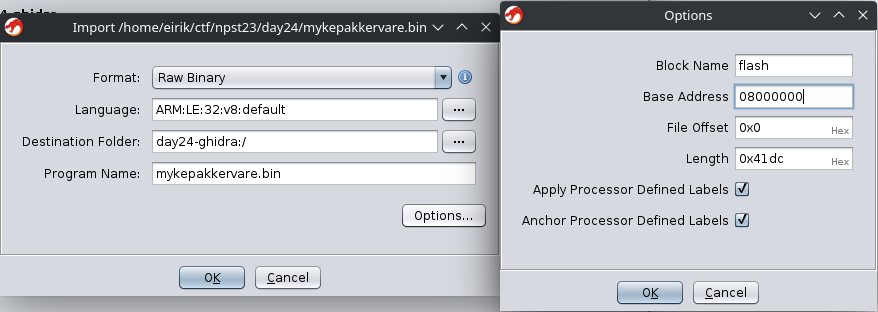
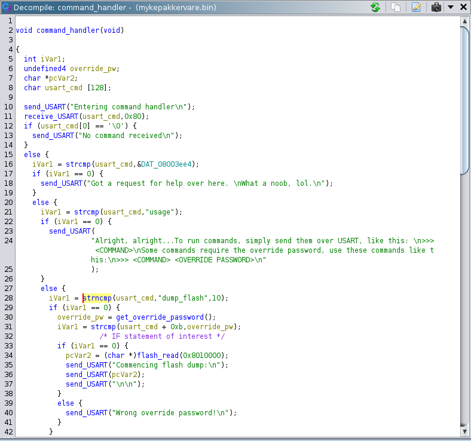
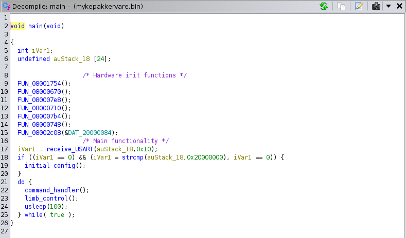
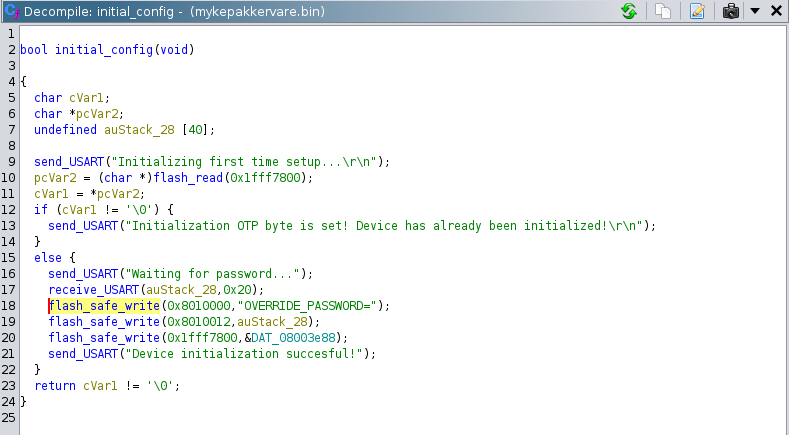
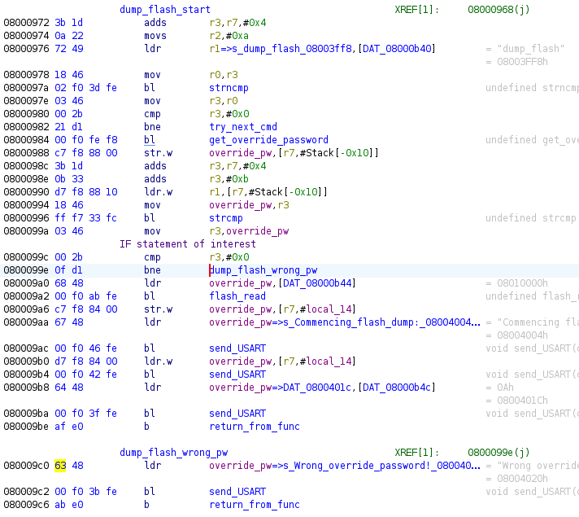
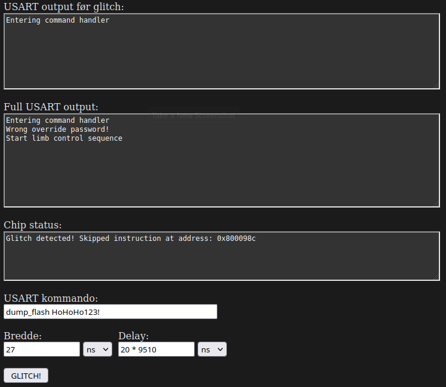
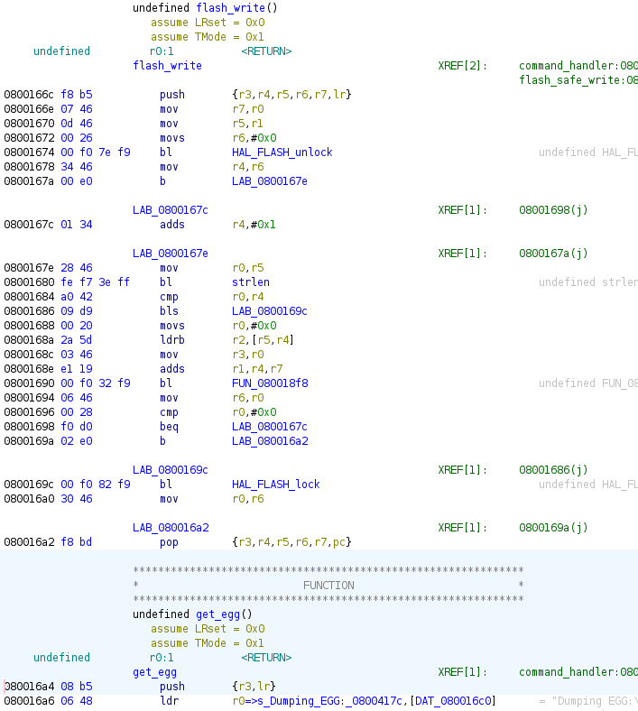
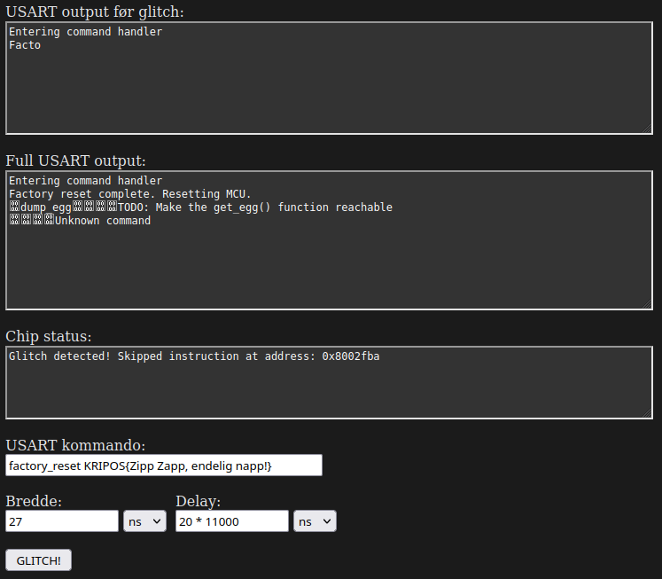
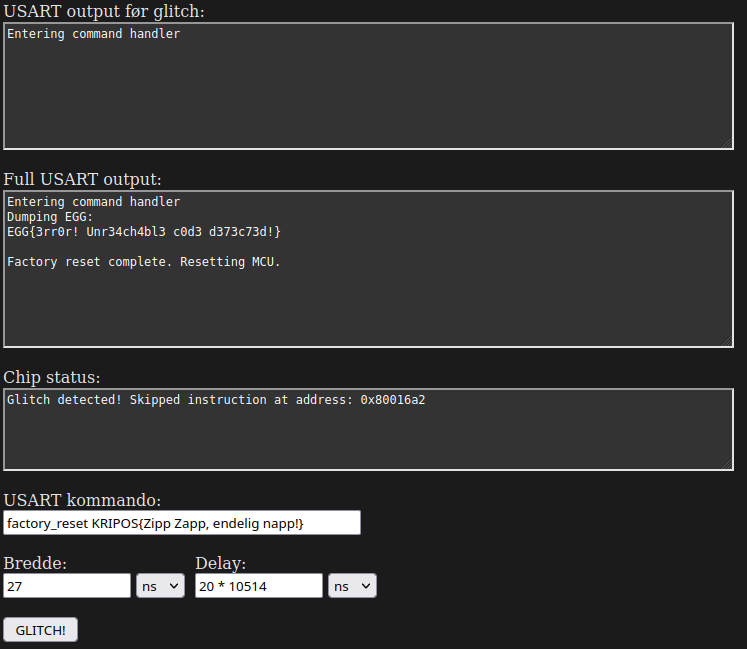

# NPST julen 2023

Dette var PSTs julekalender-CTF for julen 2023. I år var det i også i samarbeid
med NSM og Kripos. 

## Innholdsfortegnelse

- [Dag 1](#dag-1)
- [Dag 2](#dag-2)
- [Dag 3](#dag-3)
- [Dag 4](#dag-4)
- [Dag 5](#dag-5)
- [Dag 6](#dag-6)
- [Dag 7](#dag-7) 
- [Dag 8](#dag-8)
- [Dag 9](#dag-9)
- [Dag 10](#dag-10)
- [Dag 11](#dag-11)
- [Dag 12](#dag-12)
- [Dag 13](#dag-13)
- [Dag 14](#dag-14)
- [Dag 15](#dag-15)
- [Dag 16](#dag-16)
- [Dag 17](#dag-17)
- [Dag 18](#dag-18)
- [Dag 19](#dag-19)
- [Dag 20](#dag-20)
- [Dag 21](#dag-21)
- [Dag 22](#dag-22)
- [Dag 23](#dag-23)
- [Dag 24](#dag-24)

## Dag 1

[<sup>Tilbake til innholdsfortegnelse</sup>](#innholdsfortegnelse)

### Flagg

`PST{SYSTEM INFISERT GRUNKER INCOMING}`


### Oppgave
> Mobil-detektiven 📱
> 
> ---
> 
> Her får du den første oppgaven!
> 
> Under etterforskningen av hendelsen på jule-verkstedet har vi oppdaget noe
> rart. Et av meldingssystemene som sender varslinger til beredskapsvaktene for
> verkstedet har sendt en SMS til et ukjent nummer. Meldingen er dessverre helt
> uleselig for oss, så vi trenger dine mobildetektiv-egenskaper. Når du finner
> ut av det, send meg svar på formatet PST{ditt svar her}.
> 
> ```
> 7-4 9-3 7-4 8-1 3-2 6-1 0-1
> 4-3 6-2 3-3 4-3 7-4 3-2 7-3
> 8-1 0-1 4-1 7-3 8-2 6-2 5-2
> 3-2 7-3 0-1 4-3 6-2 2-3 6-3
> 6-1 4-3 6-2 4-1
> ```
> 
> \- Tastefinger


### Løsning

Det var ikke umiddelbart åpenbart for meg hva tallene betydde. Etter å ha
stirret på dem en stund kan vi se at det første tallet er alltid i intervallet
0-9 og det andre tallet er maks 4. For de som husker tastaturet på gamle 
mobiltelefoner er dette kjent. Det er nemlig hvor mange ganger man må trykke på
hver tast for å få rett tall. `7-4` betyr altså "Trykk på knapp 7 fire ganger".
Dette kan løses med dette solve scriptet: 

[`solve.py`](./dag1/solve.py):

```python
sequence = "7-4 9-3 7-4 8-1 3-2 6-1 0-1 4-3 6-2 3-3 4-3 7-4 3-2 7-3 8-1 0-1 4-1 7-3 8-2 6-2 5-2 3-2 7-3 0-1 4-3 6-2 2-3 6-3 6-1 4-3 6-2 4-1"
sequence = sequence.split(" ")

keypad = {
    1: "", 2: "ABC", 3: "DEF",
    4: "GHI", 5: "JKL", 6: "MNO",
    7: "PQRS", 8: "TUV", 9: "WXYZ",
    0: " "
}

flag = "PST{"
for seq in sequence:
    num, idx = (int(i) for i in seq.split("-"))
    idx -= 1
    flag += keypad[num][idx]

flag += "}"
print(flag)
```


### Svar

> 🤦🏻
> \- Tastefinger


## Dag 2

[<sup>Tilbake til innholdsfortegnelse</sup>](#innholdsfortegnelse)

### Flagg

`PST{LØSTE_DU_DENNE_SOM_PUSLESPILL_ELLER_KUBE?:)}`


### Oppgave

> Scrambled
> 
> ---
> 
> Over natten har det vært store utfordringer knyttet til en av maskinene i
> verkstedet. En serie feilproduserte leker har kommet på rullende bånd. Vi
> prøver å finne ut hva som har skjedd. Graver du ned i det her?
>
> \- Mellomleder

Vedlegg:


### Løsning

Fra vedlegget ser vi at vi har alle sidene til en Rubiks kube som er brettet ut
flatt, hvor hver firkant har en bokstav. Måten å løse oppgaven på er da å løse
Rubiks kuben slik at vi kan lese flagget på kuben. Det er flere måter å løse den
på. 

Den mest åpenbare måten er å løse den fysisk. Jeg gjorde opprinnelig dette,
men glemte å ta bilder av prosessen. Måten jeg gjorde det på var å først
overføre den flate kuben i en kube-løser nettside som f.eks.
[denne](https://rubiks-cube-solver.com/) hvor man kan tegne den flate kuben.
Deretter tok jeg å kjørte løsningen i revers for å få den rette kuben. Så var
det å klippe opp flere post-it-lapper og skrive bokstaver på dem, for så å løse
kuben og lese av.

En annen måte er å gjøre det manuelt i f.eks. Excel. Dette er mulig fordi hver
sub-kube i Rubiks kuben har kun én mulig plassering i en løst kube. F.eks. har
en hjørnebrikke med rød, blå og hvit kun ett rett sted i den løste kuben. Vi tar
derfor bokstavene fra den uløste kuben og overfører til de eneste stedene de
passer i en løst kube. Dette krever en del visualisering og hjernetrim, men det
går til slutt. Se [`solve.xlsx`](./dag2/solve.xlsx) for løsning. 

Etter å ha løst kuben ser vi at den rød siden sier hvilken rekkefølge vi skal
lese svaret i: `RBWGOY` = `red, blue, white, green, orange, yellow`. Dette gir
oss da flagget. 


### Svar

> Her var det mye røre! Bra du klarte å finne ut av det!
> 
> \- Mellomleder


## Dag 3

[<sup>Tilbake til innholdsfortegnelse</sup>](#innholdsfortegnelse)

### Flagg

`KRIPOS{Husk å se etter spor i snøen!}`


### Oppgave

> 📃Redacted
> 
> ---
> 
> Det er krise! Filene på alvemaskinene har blitt kryptert, og vi har ingen
> backups tilgjengelig!
> 
> På nissens skrivebord fant vi det vedlagte brevet, sammen med en kryptert fil.
> 
> Det er ubeskrivelig viktig at vi får åpnet denne filen igjen umiddelbart, da
> Jule NISSEN ikke klarer å huske innholdet!
> 
> \- Mellomleder

Vedlegg:

* [Mitt utpressingsbrev.docx](<./dag3/Mitt utpressingsbrev.docx>)
* [huskeliste.txt.enc](./dag3/huskeliste.txt.enc)

### Løsning

Vi får utdelt et Word-dokument med en ransom-note:


Det er tilsynelatende "REDACTED", men dette er kun en svart boks vi lett kan
flytte. Det samme gjelder bildet midt på siden som viser krypto-metoden. Etter å
fikse disse figurene ser dokumentet slik ut:


Vi har dermed fått nøkkelen og krypteringsmetoden. Det modifiserte
Word-dokumentet får du [her](<./dag3/Mitt utpressingsbrev løst.docx>). 

For å dekryptere huskelisten lager vi et script som leser inn ciphertexten,
kjører ROT13 på IVen og dekrypterer med AES-CTR:

[`solve.py`](./dag3/solve.py):
```python
from pathlib import Path
from binascii import unhexlify
from Crypto.Cipher import AES
from Crypto.Util import Counter

def rot13(text):
    result = []
    for char in text:
        if "a" <= char <= "z":
            result.append(chr((ord(char) - ord("a") + 13) % 26 + ord("a")))
        elif "A" <= char <= "Z":
            result.append(chr((ord(char) - ord("A") + 13) % 26 + ord("A")))
        else:
            result.append(char)
    return "".join(result)


# 24 bytes = 192 bit key
key = unhexlify("dda2846b010a6185b5e76aca4144069f88dc7a6ba49bf128")

# IV is ROT13 encoded before use
iv = "UtgangsVektor123"
iv_rot13 = rot13(iv)

iv = iv_rot13.encode()

enc = Path("./huskeliste.txt.enc").read_bytes()

cipher = AES.new(
    key,
    AES.MODE_CTR,
    counter=Counter.new(128, initial_value=int.from_bytes(iv, byteorder="big"))
)

dec = cipher.decrypt(enc)

print(dec.decode("latin-1"))
```


### Svar

> Flott!
> 
> Jeg kaller inn til et møte med Jule NISSEN og de andre påvirkede så vi kan få
> delt ut informasjonen igjen.
> 
> \- Mellomleder


## Dag 4

[<sup>Tilbake til innholdsfortegnelse</sup>](#innholdsfortegnelse)

### Flagg

`PST{ASCII_art_er_kult}`


### Oppgave

> Pinneved
>
> ---
> 
> Alvebetjentene på Jule NISSEN sitt verksted våknet i dag til et fryktelig syn;
> Julenissens slede er sprengt i fillebiter. Vi har satt folk på saken for å
> finne ut av hvem som er ansvarlig for ødeleggelsen, men det er kritisk at
> sleden blir reparert slik at vi får testet den før Jule NISSEN skal levere
> pakkene.
> 
> Alvebetjentene har samlet vrakrestene, samt verktøyet de mistenker at
> sabotørene har brukt.
> 
> Vi trenger at du rekonstruerer sleden så fort som mulig!
>
> \- Tastefinger

Vedlegg:

* [pinneved.py](./dag4/pinneved.py)
* [pinneved.txt](./dag4/pinneved.txt)


### Løsning

Dette er en reversing-oppgave hvor vi skal reversere `pinneved.py`-scriptet for
å rekonstruere sleden. Kort fortalt tar `pinneved.py`-scriptet den sammensatte
sleden og deler opp i 24 fragmenter med `explode()` funksjonen som lagres i
`bang`. Hvert tegn i hvert fragment blir så gjort om til det tegnet som kommer 2
etter som blir lagret i `eksplosjon`. Disse omgjorte fragmentene blir så satt
sammen ved å bruke indeksene i `otp` arrayet. Solve-scriptet under gjor denne
prosessen baklengs. 

[`solve.py`](./dag4/solve.py):
```python
from pathlib import Path

otp = [23, 2, 0, 5, 13, 16, 22, 7, 9, 4, 19, 21, 18, 10, 20, 11, 12, 14, 6, 1, 3, 8, 17, 15]
pinneved = Path("./pinneved.txt").read_text()

def explode(input, antall):
    størrelse = len(input) // antall
    fragmenter = []
    
    for i in range(0, len(input), størrelse):
        fragment = input[i:i+størrelse]
        fragmenter.append(fragment)
    
    return fragmenter

pinneved = explode(pinneved, 24)
pinneved_reversed = [""] * 24
for n, i in enumerate(reversed(otp)):
    pinneved_reversed[i] = pinneved[n]
eksplosjon = [
        ''.join([
            chr(ord(c) - 2) for c in fragment
        ]) 
        for fragment in pinneved_reversed
]
bang = "".join(eksplosjon)

Path("./slede.txt").write_text(bang)
print("Wrote answer to file slede.txt")
```

Den sammensatte sleden kan sees i [`slede.txt`](./dag4/slede.txt).


### Svar

> Et faktisk kunstverk! Godt jobbet!
> 
> Vi setter i gang testingen sporenstreks.
> 
> \- Tastefinger


## Dag 5

[<sup>Tilbake til innholdsfortegnelse</sup>](#innholdsfortegnelse)

### Flagg

`PST{FROGN BIBLIOTEK}`


### Oppgave

> Muldvarpjakt
> 
> ---
> 
> Gjennom temmelig hemmelige innhentingsmetoder har vi fanget opp en melding om
> et nært forestående møte på Fastlands-Norge mellom en mistenkt kildefører som
> jobber for sydpolare tjenester og et ukjent objekt vi mistenker kan være en
> muldvarp.
> 
> For at våre spaningsalver skal settes i stand til å observere møtet og
> identifisere det ukjente objektet må vi vite hvor vi skal sende våre alver.
> 
> Vi prøvde å spørre OSINT-alvene våre, men de var travelt opptatt med å
> saumfare sosiale medier etter snille og slemme barn. De mumlet noe om at vi
> kunne fikse det selv med “turbo overgang”.
> 
> Kan du ut fra meldingen finne ut hvor de skal møtes?
> 
> > Ta bussen og gå av på holdeplassen rett ved begravelsesbyrået som ligger
> > inntil en sjømatbutikk. Jeg vil stå klar ved fontenen noen titalls meter fra
> > bussholdeplassen. Når du har kommet frem til fontenen, vil vi sammen gå til
> > det nærliggende biblioteket som ligger under 50 meter fra fontenen og
> > gjennomfører overføringen.
> 
> Svar meg med navnet på møtestedet og på formen PST{BERGEN LUFTHAVN}
> 
> \- Tastefinger


### Løsning

Dette er en OSINT-oppgave hvor vi skal lokalisere et sted basert på en
beskrivelse. Det er gitt et hint om at vi kan bruke "turbo overgang", altså
tjenesten [Overpass Turbo](https://overpass-turbo.eu/).

Vi ser nærmere på plassbeskrivelsen. Uthevelsene er mine:

> Ta bussen og gå av på **holdeplassen rett ved begravelsesbyrået** som ligger
> **inntil en sjømatbutikk**. Jeg vil stå klar ved **fontenen noen titalls meter
> fra bussholdeplassen**. Når du har kommet frem til fontenen, vil vi sammen gå
> til det **nærliggende biblioteket som ligger under 50 meter fra fontenen** og
> gjennomfører overføringen.

Basert på dette kan vi formulere den følgende Overpass Turbo queryen:

```
area[name="Norge"]->.no;                      
node(area.no)[shop="seafood"];                
node(around:10.0)[shop="funeral_directors"];  
node(around:100.0)[amenity="fountain"];       
node(around:50.0)[amenity="library"];         
                                              
out;                                          
```


Her har jeg ikke tatt med bussholdeplassen da jeg ikke visste hvordan, men det
viste seg å ikke være nødvendig. Den første linjen begrenser oss til
fastlands-Norge som spesifisert i oppgaven. De andre bruker filtre for å få
resultater som ligger nær de andre stedene. Dette gir kun ett resultat i Drøbak,
og vi finner dermed "Frogn bibliotek". 


### Svar

> Ypperlig! Nå har vi dem! :)
> 
> \- Tastefinger


## Dag 6

[<sup>Tilbake til innholdsfortegnelse</sup>](#innholdsfortegnelse)

### Flagg

`PST{PepperkakerErMotbydelige}`


### Oppgave

> 🍪 KAKER-kontroll
> 
> ---
> 
> I en standard KAKER-kontroll (Kontroll Av Kommuniké med Eksport-Restriksjoner) har det blitt tatt en kopi av dette dokumentet. Vi syns det er snodig at akkurat denne personen har hatt med seg dokumentet siden personen har hatt anti-jul-holdninger tidligere, og vi vil derfor at du tar en nærmere kikk for å se etter uhumskheter.
> 
> \- Tastefinger
> 
> ```
> PE‍PPERKAKER {
>     POR‍SJONER {
>         20 kaker
>     }
>     ‍TYPE ‍{
>         julekake 
>     }
>     INGREDIENSER {
>         KAKEDEIG {
>             2 ts ‍Pepper
>             2 ts Malt ing‍efær
>             0,5 ts Malt nellik
>             3 dl Mørk siru‍p
>             300 g Smør
>             2 ts Malt kanel
>             4 ts Natron
>             2 stk. Egg
>             300 g Sukker
>             ca. 900 g Hvetemel
>         }
>         MELISGLASUR {
>             ca. 250 g Melis
>             1 stk. Eggehvite
>             0,5 ts Sitronsaft
>         }
>     }
>     OPPSKRIFT {
>         STEG1 { Bland smør, siru‍p og sukker i en kjele. Varm opp til sukkeret er sm‍eltet. Tilsett nellik, ingefæ‍r, pepper og kanel, og rør godt sammen. }
>         STEG2 { Ta ‍kjelen av platen og avkjøl bl‍andingen noe. Rør inn egg. }
>         STEG3 { Ha i natron, og si‍kt inn mel. Rør alt sammen til ‍en jevn deig. Deigen skal væ‍re ganske myk og klissete, den vil bli mye hardere når den blir kald! }
>         STEG4 { Hell deigen over i en bolle og dryss litt hvetemel på toppen. Dekk til med litt plastfolie og sett deigen kaldt noen timer, gjerne over natten. }
>         STEG5 { Skjær løs et stykke av deigen. Plasser resten av deigen tilbake i kjøleskapet. ‍Elt deigen forsiktig. Tilsett litt me‍r mel om den virker for myk. }
>         STEG6 { ‍Mel en flate, ‍og kjevle deigen ut til ca 3 mm tykkelse. Det er enklest når deigen er myk som plas‍tilina. Stikk ut pepperkakefigurer og flytt dem over på et ‍bakepapirkledd stekebrett. Samle restene av deigen og legg den kaldt. Skjær ut et n‍ytt stykke av ‍deigen og gjenta prosessen. Deigen blir vanskelig å jobbe med når den blir for varm, så da kan d‍en få hvile i kjøleskapet igjen. }
>         STEG7 { Stek kakene midt i stekeovnen på 175 °C i ca. 10 minutter. Avkjø‍l kakene helt på rist. }
>         STEG8 { Bland sammen mel‍is, eggehvite og sitronsaft til en tykk ‍glasur, og dekorer kaken‍e. }
>     ‍}
> }
> ```


### Løsning

Denne ble ganske enkel for meg for det første jeg gjorde etter å ha kopiert
pepperkakeoppskriften til en egen fil var å åpne den i Vim, og da kom det
tydelig frem at det var noen skulte tegn i teksten. Disse tegnene er [Unicode
`200d` - Zero Width Joiner (ZWJ)](https://www.compart.com/en/unicode/U+200D). Hvis vi
ser på den etterfølgende bokstaven for hver ZWJ ser vi at det staver starten på
flagget. Følgende solve script leser inn teksten og henter ut flagget.

[`solve.py`](./dag6/solve.py):
```python
import re
from pathlib import Path

text = Path("./input.txt").read_text().encode("utf-8")
special = b"\xE2\x80\x8d"  # https://www.compart.com/en/unicode/U+200D

flag = ""
for match in re.finditer(special, text):
    i = match.span()[1]
    flag += chr(text[i])

print(flag)
```

Merk at ZWJ har en annen byte-representasjon enn Unicode code point. 

### Svar

> Hvordan kan man ikke like pepperkaker?!
> 
> \- Tastefinger


## Dag 7

[<sup>Tilbake til innholdsfortegnelse</sup>](#innholdsfortegnelse)

### Flagg

`NSM{af0dbd13cee45990593c182b213f978d}`


### Oppgave

> Alle gode ting er tre
> 
> ---
> 
> Alveresepsjonen fant en mystisk lapp i postboksen til Nissens verksted i dag
> tidlig. Vanligvis er dette noe Ronny, Shahana og Ada fra alvdeling for
> kryptografi ville tatt seg av. Dessverre er alle tre bortreist på en viktig
> konferanse i San Francisco for å høre om den siste utviklingen innen
> eksponenter og modulær aritmetikk. Kan du steppe inn for dem og finne ut av
> hva denne beskjeden egentlig er for noe?
> 
> \- Mellomleder

Vedlegg:

* [msg.txt](./dag7/msg.txt)


### Løsning

Den vedlagte meldingen inneholder tre tall som minner veldig om RSA. Denne
mistanken blir også bekreftet av navnene "Ronny, Shahana og Ada" fra
oppgaveteksten. 

Sårbarheten er her at vi bruker RSA-algoritmen direkte for å kryptere en
plaintext og en liten eksponent `e`. Der er derfor så enkelt som å ta den
modulære kube-roten av ciphertexten (mod N) for å få plaintexten. Se script
under.

[`solve.py`](./dag7/solve.py):
```python
from gmpy2 import iroot

N = 0x5993c05eac819aa17ae7e4e4b9f75b2d6fdbaec913e0b2d6f4ba585a991b62279ed9ac53aeadee3327321e02c0c06ecda184952df5d1cc8b3024643c0afdd9bbd52bf2d830f54d6e59e76844394eb0ffc498995dd270b9b95bf1614984472a3ef12d8c1bad64529be7b638c5d0fccf61c5ac2ab4564e5215748eb2533d4d949afd9486426dbf0c06a07c2c0f6d482e4f8cf3052e6ab9df20878b747936d590c3b8bb0219a378cbec03baee4ea8d0641c57bcc18706bbe92c3f2d7569c424062d9b79464958419b4000e3e31c077bba27ef2fc6ed15b7ebdcdb41d1cbf7708737e200904015d341ef94c537a916f1fec61e0b1bf64762e5a97bafdde290b939c3
e = 3
C = 0x755040806d1d699c76cf2b3fffc28ad8831a8667e1b064297a43733b89f6272483a5a728b725d02b069f8fc65eb51d89ce9133df8f5f2d5e13f63c5423021eb2b56eeb91b11d78717528dfce169450a08d40f5ab451c8ac1f8c6875cffbd4d70259d436ed70baeae37b9bdafc5965

M, success = iroot(C, e)
M = int(M)
m = M.to_bytes((M.bit_length() + 7) // 8, "big").decode()
print(m)
```


### Svar

> Jeg tror jeg trenger hele alvdelingen for kryptografi for å forstå meg på
> denne her, men bra du fikk det til!
> 
> \- Mellomleder


## Dag 8

[<sup>Tilbake til innholdsfortegnelse</sup>](#innholdsfortegnelse)

### Flagg

`NSM{65d77649dcd02ab0fed102c3e3d3d33faba1874038c7bda737c40604021034b4}`


### Oppgave

> Ransomware
> 
> ---
> 
> Skjermen på en av datamaskinene på NISSENS verksted ble plutselig dekket av
> mange meldinger om at viktige filer var blitt kryptert. Et team av alver
> klarte å finne igjen denne filen sammen med en høyst mistenkelig fil, men
> klarer ikke å dekryptere filen. De har delt filene i et ZIP-arkiv med
> `infected` som passord. Klarer du å få tilbake den viktige filen?
> 
> \- Tastefinger

Vedlegg:

* [mistenkelig_beslag.zip](./dag8/mistenkelig_beslag.zip)
    - [wuauclt.exe](./dag8/wuauclt.exe)
    - [flagg.kryptert](./dag8/flagg.kryptert)


### Løsning

TODO


### Svar

> Kjempeflott! Nå skal vi klare å røske ut infeksjonen!
> 
> \- Tastefinger


### Egg

`EGG{BEEPBOOP}`

I dekompileringen finner vi en funksjon med mange `Beep()` og `Sleep()`
funksjoner. Den første, døpt `beep1`, ser mistenksomt ut som morse-kode. Dette
løser jeg for hånd og får egget over. 

Det er to andre funksjoner som også har mange `Beep()` og `Sleep()` funksjoner.
Disse er ikke morse, men spiller en sang. I scriptet
[`beep_analysis.py`](./dag8/beep_analysis.py) har jeg skrevet kode for å spille
av denne sangen. Jeg klarte ikkke å høre hvilken sang det var, men med hjelp fra
noen på Discord fant vi ut at det var [Coffin
Dance](https://www.youtube.com/watch?v=j9V78UbdzWI). Du kan høre den
~øreskjærende~ nydelige sangen i filen [`beep.wav`](./dag8/beep.wav). 


## Dag 9

[<sup>Tilbake til innholdsfortegnelse</sup>](#innholdsfortegnelse)

### Flagg

`KRIPOS{13:20}`


### Oppgave

> 🕖 Kronolokalisering
> 
> ---
> 
> Gjennom et beslag har vi fått tak i et papirark. På den ene siden står det
> “Oppmøtested for den topphemmelige sydpolinfiltrasjonen 2023, rekognosering
> 23. november”. På den andre siden av arket er det et bilde. For å kunne hente
> inn overvåkingsbilder og identifisere hvem som har planlagt arrangementet
> trenger vi det nøyaktige tidspunktet bildet er tatt.
> 
> Send meg svar på denne eposten som KRIPOS{tidspunkt}, f.eks. KRIPOS{23:35},
> rundet av til nærmeste fem minutter.
> 
> \- Mellomleder

Vedlegg:


### Løsning

Jeg kjente ikke igjen bygget på bildet så jeg brukte Google Reverse Image Search
og fant at det var Europol sitt bygg i Haag. Det er ingen EXIF-metadata om når
bildet ble tatt, så for å finne ut når bildet ble tatt må vi bruke solen. Det
finnes flere ressurser online for å gjøre dette. Jeg brukte
[suncalc.org](https://www.suncalc.org/) for å finne ut hvordan skyggen falt på
ulike tidspunkt. Med mye prøving og feiling fant jeg
[dette](https://www.suncalc.org/#/52.093,4.282,19/2023.11.23/13:20/30/1)
tidspunktet hvor skyggen faller omtrent som på bildet. 


### Svar

> Strålende! Jeg setter igang Tastefinger for å finne skurken!
> 
> \- Mellomleder


## Dag 10

[<sup>Tilbake til innholdsfortegnelse</sup>](#innholdsfortegnelse)

### Flagg

`PST{julenisseStreng0Alv}`


### Oppgave

> Alvesortering
> 
> ---
> 
> De strenge alvene har skrevet ned et julekodeord, men i den ivrige sorteringen
> av pakker har det skjedd en horribel feil og alt er blitt rot! Ordet har blitt
> borte i det som ser ut som et virrvarr av tilfeldig tekst! Nå trenger de hjelp
> til å gjenfinne ordet. De har null peiling på hvor langt ordet er. Kan du å
> gjenfinne ordet?
> 
> \- Mellomleder

Vedlegg:

* [random_text.bin](./dag10/random_text.bin)


### Løsning

Det er ikke mye å bli klok av ved å se på linjene i den utdelte filen. Man må
rett og slett bare prøve ulike måter å masere dataen på. Én slik måte er å
sortere linjene basert på lengden, og dette viser seg å gi flagget.

[`solve.py`](./dag10/solve.py):
```python
from pathlib import Path

input_file = Path("./random_text.bin")

data = input_file.read_bytes()
data = [d for d in data.split(b"\x00") if len(d) > 0]
data = sorted(data, key=lambda x: len(x))
flag = ""
for d in data:
    f = chr(d[0])
    flag += f
    if f == "}":
        break

print(flag)
```


### Svar

> Bra det ble orden på sakene!
> 
> \- Mellomleder


## Dag 11

[<sup>Tilbake til innholdsfortegnelse</sup>](#innholdsfortegnelse)

### Flagg

`NSM{9c7cac722d55da1dbfa13025d85efeed45e9ddea2796c0e5ea2fda81ea4de17d}`


### Oppgave

> 🌍 Informasjonsdeling
> 
> ---
> 
> NISSENS verksted har mottatt en mystisk melding og litt kode for å dekryptere
> meldingen. Noen alver i førstelinjen har sett på det, og blir ikke helt kloke.
> De mistenker at kun denne ene hemmeligheten ikke er nok. Kanskje er det andre
> som sitter på mer info?
> 
> \- Mellomleder

Vedlegg:

* [filer.zip](./dag11/filer.zip)
    - [dekrypter_melding.py](./dag11/dekrypter_melding.py)
    - [melding.enc](./dag11/melding.enc)


#### NISM

Tidligere i desember valgte vi tilhørighet til en tjeneste, og siden jeg valgte
NISM fikk jeg en spesiell melding fra de. De som valgte de andre fikk
tilsvarende meldinger fra NPST og KRIAPOS. 

> Mystifistisk pakke
> 
> ---
> 
> Heisann alle sammen!
> 
> Det kom et bud innom med en pakke som vi ikke klarer å finne ut av. Budet la
> igjen en post-it lapp med
> `02a5588f275984a2296d505067ec727ff3a27b860ebda01a82f408f7aa4cda96` på og
> pakken er vedlagt i meldingen.
> 
> \- 📞 Sentralbordet

Vedlegg:

* [nism.zip](./dag11/nism/nism.zip)
    - [hemmelighet_2.txt](./dag11/nism/hemmelighet_2.txt)


#### Hemmeligheter

Alle hemmelighetene fra hver tjeneste ble delt på Discord og finnes i
[hemmeligheter.txt](./dag11/hemmeligheter.txt):

```
hex_str1 = "a3c5a5a81ebc62c6144a9dc1ae5cce11"
hex_str2 = "980daad49738f76b80c8fafb0673ff1b"
hex_str3 = "fc78e6fee2138b798e1e51ed15e0a109"
```


### Løsning

Her var vi nødt til å samarbeide for å få alle hemmelighetene. Når man hadde
alle hemmelighetene gjalt det å sette dem sammen på den rette måten. Litt
prøving og feiling måtte til, men til slutt fant jeg ut at de skulle XORes
sammen. XOR-resultatet er altså nøkkelen for å dekryptere flagget, og det var
enkelt å fylle inn i det utleverte dekrypterings-scriptet. 

[`solve.py`](./dag11/solve.py):
```python
from Crypto.Cipher import AES
from base64 import b64decode
import json

from binascii import unhexlify


# from hemmeligheter.txt
hexstrs = ["a3c5a5a81ebc62c6144a9dc1ae5cce11",
           "980daad49738f76b80c8fafb0673ff1b",
           "fc78e6fee2138b798e1e51ed15e0a109"]

key = 0
for k in hexstrs:
    key ^= int.from_bytes(unhexlify(k), "big")

key = key.to_bytes((key.bit_length() + 7 ) // 8, "big")

with open("melding.enc", "rb") as f:
    data = json.loads(f.read())
    nonce = b64decode(data["nonce"])
    ciphertext = b64decode(data["ciphertext"])
    tag = b64decode(data["tag"])
    cipher = AES.new(key, AES.MODE_GCM, nonce = nonce)
    plaintext = cipher.decrypt_and_verify(ciphertext, tag)
    print("Dekryptert melding: " + plaintext.decode('utf-8'))
```

### Svar

> Strålende samarbeid her! Flott dere får til å samarbeide på tvers sånn.
> 
> \- Mellomleder


## Dag 12

[<sup>Tilbake til innholdsfortegnelse</sup>](#innholdsfortegnelse)

### Flagg

`PST{I_cAn_HaZ_rEciprOCaTeD_tRuzT?}`


### Oppgave

> Pakkestorm
> 
> ---
> 
> Jeg har vært på et temmelig hemmelig oppdrag og fulgt med på en server som har
> hatt mistenkelig oppførsel tidligere. Nå tok vi den igjen når den begynte å
> sende masse pakker, men selv om jeg som alle andre alver liker pakker så ble
> det litt for mye av det gode. Kan du finne de onde for meg?
> 
> \- Tastefinger

Vedlegg:

* [fangede_pakker.pcap](./dag12/fangede_pakker.pcap)


### Løsning

Her var det mye veldig mange pakker, og hvis man naivt prøver å sette sammen
pakkene til flagg får man veldig mange mulige. Det er ingen åpenbar måte å finne
ut hviket flagg som er det rette, og det er for mange å brute-force. Det er
derimot et hint i oppgaveteksten. Vi skal finne de "onde" pakkene, og det er en
aprilsnarr RFC som foreslår å bruke en reservert bit i IP-headeren som ["Evil
bit"](https://en.wikipedia.org/wiki/Evil_bit). Dette er det vi er på jakt etter
her, og med solve scriptet under får vi flagget. 


[`solve.py`](./dag12/solve.py):
```python
import time
from pathlib import Path
from scapy.all import PcapReader, IP, Raw

pcap_path = Path("./fangede_pakker.pcap")

t0 = time.time()
flag = ""
with PcapReader(str(pcap_path)) as reader:
    for i, packet in enumerate(reader):
        if IP not in packet:
            print(f"No IP in packet {i}")
            packet.show()
            continue

        src = packet[IP].src
        dst = packet[IP].dst

        # https://en.wikipedia.org/wiki/Evil_bit
        evil = packet[IP]
        if "evil" in evil.flags:
            raw = Raw(packet[IP].payload)
            data = raw.load.decode()
            c = chr(int(data, 2))
            flag += c

t1 = time.time()
print(f"Timing: parse={t1 - t0:.2f}s")

print("Flag:", flag)
```

### Svar

> Flott at du fant ut av det her. Jeg har gått skikkelig lei av å sitte og
> stirre på den serveren.
> 
> \- Tastefinger


## Dag 13

[<sup>Tilbake til innholdsfortegnelse</sup>](#innholdsfortegnelse)

### Flagg

`KRIPOS{Perth}`


### Oppgave

> GeoGjettr
> 
> ---
> 
> Ledelsen har fått dilla på GeoGjettr og jeg er med i en konkurranse, men
> klarer ikke finne ut av hvilken by bildet her er fra. Kan du hjelpe meg litt
> fort?
> 
> Svar meg med KRIPOS{navn på by}.
> 
> \- Mellomleder

Vedlegg:


### Løsning

Scanner vi QR-koden får vi muligheten til å koble til et trådløst nett med navn
"The state building". Et søk på Google gir kun ett resultat i Perth, Australia.
Vi kan bekrefte at vi har den rette plassen ved å sammenlikne bilder fra
innsiden av baren "Beer Corner". 


### Svar

> Haha! Nå leder jeg!
> 
> \- Mellomleder


## Dag 14

[<sup>Tilbake til innholdsfortegnelse</sup>](#innholdsfortegnelse)

### Flagg

`PST{BOKSTAVJAKT}`

### Oppgave

> 📖 Bokorm
> 
> ---
> 
> En snok vi mistenker å stå i ledetog med Pen GWYN har blitt arrestert etter å
> ha brutt seg inn i NordPolarBiblioteket og stjålet noen bøker. Vi mistenker at
> de har vært ute etter noe spesifikt, men vi blir ikke helt kloke på hva det
> er. Snoken ble tatt med en stabel bøker og et notat.
> 
> Bøkene har vi gitt tilbake til biblioteket, men her er en liste av dem som ble
> stjålet:
> 
> * Norrøn arverett og samfunnsstruktur
> * Radium og radioaktive stoffer, samt nyere opdagelser angaaende straaler
> * Undertrykking av objekter med høy luminans ved hjelp av en romlig
>   lysmodulator under avbildning med CCD- og lysforsterkningskamera
> * Om den yngre Jernalder i Norge : 1. afdeling
> * Storlogens Konstitution og Tillægslove
> * Sild- og saltfiskretter
> 
> Notatet inneholdt dette her: 
>
> (55, 1, 2, 1), (65, 17, 6, 3), (19, 3, 8, 1), (13, 5, 6, 2), (14, 11, 4, 8),
> (27, 32, 12, 2), (9, 7, 12, 3), (82, 5, 2, 8), (78, 3, 11, 1), (71, 5, 1, 8),
> (76, 1, 6, 2), (92, 1, 1, 1), (50, 2, 1, 5), (15, 1, 1, 1), (82, 16, 10, 4),
> (23, 6, 1, 1), (34, 16, 7, 1), (92, 11, 3, 2), (50, 5, 6, 1), (1, 3, 5, 12),
> (42, 2, 1, 1), (15, 3, 1, 3), (23, 8, 1, 2), (90, 2, 5, 1), (83, 1, 1, 2),
> (59, 29, 9, 4), (93, 4, 1, 16), (82, 8, 3, 5), (39, 1, 1, 8), (77, 7, 9, 1),
> (93, 8, 6, 8), (1, 1, 3, 6), (83, 10, 8, 1), (23, 1, 1, 1), (69, 2, 9, 2),
> (76, 12, 3, 4), (7, 1, 3, 1), (3, 9, 9, 2), (19, 1, 6, 10), (93, 14, 7, 5),
> (13, 31, 7, 10), (3, 1, 9, 2), (7, 2, 6, 1), (23, 19, 4, 3), (50, 6, 5, 11)
> 
> Send svar til meg om du finner ut av det.
> 
> \- Tastefinger


### Løsning

Vi skal på en eller annen måte bruke tallene for å hente ut bokstaver fra en
eller flere av bøkene i listen. Alle bøkene er tilgjengelig digitalt på
Nasjonalbibliotekets Nettbibliotek, men kun én bok, "Om den yngre Jernalder i
Norge : 1. afdeling", er tilgjengelig uten å søke om det.
[Her](https://www.nb.no/items/ca795dec965d2fb7abb5dffa71a7f81c?page=0&searchText=Om%20den%20yngre%20Jernalder%20i%20Norge)
 er link til boken. Vi kan derfor anta at vi skal bruke kun den (og det ble
 bekreftet til meg fra noen på Discord). 

Spørsmålet er nå hvordan vi skal tolke tallene. Det finnes noe som heter ["Book
cipher"](https://en.wikipedia.org/wiki/Book_cipher) som har ulike størrelser. I
det tilfellet hvor vi har fire tall har vi at tallene representerer `side,
linje, ord, bokstav`. Går vi gjennom boken får vi følgende:

```
55	1	2	1  = P
65	17	6	3  = S
19	3	8	1  = T
13	5	6	2  = K
14	11	4	8  = R
27	32	12	2  = Ø
9	7	12	3  = L
82	5	2	8  = L
78	3	11	1  = P
71	5	1	8  = A
76	1	6	2  = R
92	1	1	1  = E
50	2	1	5  = N
15	1	1	1  = T
82	16	10	4  = L
23	6	1	1  = S
34	16	7	1  = B
92	11	3	2  = O
50	5	6	1  = K
1	3	5	12 = S
42	2	1	1  = T
15	3	1	3  = A
23	8	1	2  = V
90	2	5	1  = J
83	1	1	2  = A
59	29	9	4  = K
93	4	1	16 = T
82	8	3	5  = K
39	1	1	8  = R
77	7	9	1  = Ø
93	8	6	8  = D
1	1	3	6  = L
83	10	8	1  = A
23	1	1	1  = A
69	2	9	2  = R
76	12	3	4  = E
7	1	3	1  = V
3	9	9	2  = T
19	1	6	10 = E
93	14	7	5  = S
13	31	7	10 = S
3	1	9	2  = L
7	2	6	1  = U
23	19	4	3  = T
50	6	5	11 = T
```

På en linje blir det: `PST KRØLLPARENTLS BOKSTAV JAKT K RØD LAAREVTES SLUTT`

Bokstavene er manuelt hentet ut fra boken, og til tross for dobbeltsjekking har
det helt sikkert oppstått feil fordi bokstavene gir ikke helt mening. Vi
kan uansett forstå meningen, og får flagget. 


### Svar

> Da er det bare å legge snoken i jern da!
> 
> \- Tastefinger


## Dag 15

[<sup>Tilbake til innholdsfortegnelse</sup>](#innholdsfortegnelse)

### Flagg

`PST{e32ba07d1254bafd1683b109c0fd6d6c}`


### Oppgave

> Bit-råte
> 
> ---
> 
> Brukerveiledningen til en av de eldste maskinene på verkstedet har blitt
> borte. Heldigvis har Julenissens arkiv 1000 sikkerhetskopier av dokumentet på
> magnetbånd. Det viser seg at alle kopiene er kraftig angrepet av bit-råte så
> dokumentet må gjenoppbygges. Ifølge arkivalven så er brukerveiledningen
> skrevet på gammel-nordpolarsk som har samme alfabet som norsk, men inneholder
> ikke nye tegn som disse: {}#$[]§¤@
> 
> Når du finer ut av det så send meg MD5-sjekksummen til det gjenoppbyggede
> dokumentet på formen PST{checksum}. Svaret er ikke versalfølsomt.
> 
> \- Mellomleder

Vedlegg:

* [backups.zip](./dag15/backups.zip)
    - [manual.bak.NNN](./dag15/backups/), hvor `NNN = {000..999}`


### Løsning

Bit-råte tyder på at enkelt bits i dataen har flippet og gjort dataen uleselig,
og at bitsene har flippet forskjellig i hver backup. Det er derimot usannsynlig
at samme bit flipper i alle backup-filene, og at majoriteten av filene
inneholder rett tegn på rett plass. Derfor kan vi konstruere manualen ved å gå
gjennom alle backup-filene og for hver plass (index) "stemme" på hvilket tegn
som forekommer mest, og bruke det hyppigste tegnet som det rette. Vi må også
fjerne de tegnene som ikke er med. Solve scriptet under gjør akkurat dette. Den
rekonstruerte manualen kan leses i [`manual`](./dag15/manual). 


[`solve.py`](./dag15/solve.py):
```python
from pathlib import Path
from hashlib import md5

class Vote:
    def __init__(self):
        self.votes = {}

    def vote(self, char: str):
        self.votes[char] = self.votes.get(char, 0) + 1

    def result(self):
        return sorted(self.votes.items(), key=lambda x: x[1], reverse=True)[0][0]


base_path = Path("./backups")
disallowed = "{}#$[]§¤@"

byte_count = 3271
file_count = 1000
votes = []
for _ in range(byte_count):
    votes.append(Vote())
    
for i in range(file_count):
    file_name = f"manual.bak.{i:03d}"
    file_path = base_path / file_name
    data = file_path.read_text(encoding="latin-1")
    for j, c in enumerate(data):
        if c not in disallowed:
            votes[j].vote(c)

text = ""
for vote in votes:
    r = vote.result()
    text += r

output_path = Path("./manual")
written = output_path.write_text(text, encoding="latin-1")
print("Wrote", written, "bytes to", output_path)

flag = "PST{" + md5(text.encode("latin-1")).hexdigest() + "}"
print(flag)
```

### Svar

> Og jeg som trodde magnetbånd var noe en brukte for å henge opp bilder på
> kjøleskapet...
> 
> \- Mellomleder


## Dag 16

[<sup>Tilbake til innholdsfortegnelse</sup>](#innholdsfortegnelse)

### Flagg

`KRIPOS{Flagg i alle kriker og kroker}`


### Oppgave

> Invasjon
> 
> ---
> 
> Gjennom temmelig hemmelige innhentingsmetoder har vi fått tak i det vedlagte
> dokumentet som avslører den egentlige hensikten bak løsepengeangrepet:
> Sydpolare aktører planlegger å invadere Nordpolen for å stoppe julen én gang
> for alle!
> 
> I dokumentet nevnes det at aktørene har plantet deep-cover agenter i blant
> oss, og at de har hemmelige koder for å etablere kontakt med disse. Analyser
> materialet og se om du klarer å avsløre de hemmelige kodene slik at vi kan få
> disse agentene på kroken!
> 
> I mellomtiden iverksetter vi umiddelbare mottiltak for å stanse invasjonen.
> 
> \- Tastefinger

Vedlegg:

* [aksjon_2023.zip](./dag16/aksjon_2023.zip)
    - [plan.md](./dag16/aksjon_2023/plan.md)
    - [.git/](./dag16/aksjon_2023/dot-git/)

### Løsning

Når vi åpner zip-filen får vi en plan og en `.git`-mappe. Vi kan lete gjennom
logs og branches og finner en interesant branch
`origin/ikke-merge-før-julaften`. Når vi kjører `checkout` på den får vi en ny
fil
[`feltagenter_kontaktmanual.md`](/npst23/dag16/aksjon_2023/feltagenter_kontaktmanual.md)
. Her er det derimot kun placeholdere, og ingen andre brancher eller commits har
noe interessant. 

Når vi leter gjennom `.git`-mappen finner vi to hooks:
[`pre-commit`](./dag16/aksjon_2023/dot-git/hooks/pre-commit) og 
[`pre-merge-commit`](./dag16/aksjon_2023/dot-git/hooks/pre-merge-commit). I den
sistnevnte filen finner vi mange base64-enkodet strenger og `sed`-uttrykk for å
modifisere filene før de merges. Vi ser også at hvis environment variabelen
`DISABLE_SELF_DESTRUCT` er satt (`-z` betyr empty, altså ikke definert) kjøres
vil ikke kodene bli slettet. 

Vi kan defor kjøre 

```bash
DISABLE_SELF_DESTRUCT="1" git merge origin/ikke-merge-før-julaften
```

og få merget filene fra branchen til master og kjøre hooken _uten_ å slette
kodene etter de har merget. Da får vi flagget i kontaktmanualen. 


### Svar

> Jeg tenker vi skal vagge ned til fiskeforhandleren og se hva vi ser jeg!
> 
> \- Tastefinger


### Egg

`EGG{h3ng3r 0g d1ngl3r}`

Hooken [`pre-commit`](./dag16/aksjon_2023/dot-git/hooks/pre-commit) hinter til
at det finnes et egg i git-repoet: `Har noen sett egget mitt? Jeg vet HELT
sikkert at jeg la det inn i git, men klarer ikke finne det igjen noe sted...`.
Jeg skjønte ikke hva de hintet til, men etter å få tips på Discord var det visst
en "dangling blob" som inneholdt egget. 

Man kan få hashen til "dangling blobs" ved å kjøre `git fsck`. Da får vi hashen
`fdfbb6ab8dda68e83853bf372a100e8ff6e8830f`. Innholdet i dangling bloben kan man
se ved å kjøre `git show [hash]`, og ved å kjøre den kommandoen med hashen vår
får vi flagget i en nydelig ASCII-art egg. Se full output i
[`egg-full.txt`](./dag16/egg-full.txt)


## Dag 17

[<sup>Tilbake til innholdsfortegnelse</sup>](#innholdsfortegnelse)

### Flagg

`pst{nede for telling}`


### Oppgave

> Innebygde ord
> 
> ---
> 
> Vi har snappet opp to meldinger som ble sendt til hovedobjektet i J-SAK EMBED.
> Vi mistenker at meldingene ikke er hva det ser ut til å være.
> 
> Den første meldingen som ble sendt var en merkelig tekst om å telle, mens
> melding nummer to bare ser ut til å være en rekke med tall. Vi tror det er en
> betydning i disse tallene, kan du se på det og gi oss tilbakemelding hvis du
> finner noe meningsfylt?
> 
> \- Tastefinger

Vedlegg:

* [melding\_1.txt](./dag17/melding_1.txt)
* [melding\_2.txt](./dag17/melding_2.txt)


### Løsning

Her får vi to meldinger, den første er en slags gåte og den andre er mange tall.
Jeg hadde mange feil teorier før jeg klarte denne, som at det var ulike former
for klassiske ciphere (Caesar, Vigenere, Autokey, etc.), men ingen så ut til å
lede noen vei. 

Til slutt viste det seg at man skulle bruke den først meldingen
som alfabet ved å lage en liste over unike tegn, men bevare rekkefølgen de
kommer i i meldingen. Da gjenstår det bare å bruke tallene som indeks i de unike
tegnene for å få flagget.

[`solve.py`](./dag17/solve.py):
```python
melding1 = open("melding_1.txt").read()
numbers = [int(n) for n in open("melding_2.txt").read().split(", ")]

unique = ""
for c in melding1:
    if c not in unique:
        unique += c

flag = ""
for n in numbers:
    flag += unique[n]

print(flag)
```


### Svar

> Naturligvis! Nå tror jeg vi har en vektor for å få løst denne saken.
> 
> \- Tastefinger


## Dag 18

[<sup>Tilbake til innholdsfortegnelse</sup>](#innholdsfortegnelse)

### Flagg

`pst{var_julenissen_kong_leonidas}`


### Oppgave

> Melding fra antikken
> 
> ---
> 
> I riktig gamle dager hadde NISSEN flere regionskontor spredt rundt i verden.
> Disse kontorene fungerte både som mottak for ønskelister og
> distribusjonssenter for gaver. Da som nå var det ikke alle som oppførte seg
> like pent fram mot jul, og ifølge historiebøkene var spesielt organisasjonen
> PERSIUS (ledet av den onde Dr. Xerxes) stadig vekk på spion- og toktforsøk mot
> ett av NISSENs regionkontor. På sitt verste var det angivelig hele 300
> alvebetjenter i sving for å forsvare gaver og ønskelister. De særs tapre
> alvene til tross, NISSEN var reelt bekymret for at viktig informasjon og gaver
> skulle havne på avveie. Siden den gang har derfor all julesensitiv informasjon
> blitt kryptert.
> 
> Takket være noen alvorlige logistikkproblemer (og muligens en streik eller to)
> har plutselig en slik gammel melding dukket opp. Julelovens paragraf
> §133-syvende ledd er imidlertid krystallklar
> 
> > Enhver julesensitiv informasjon må analyseres og vurderes før den avgraderes
> > høytid.
> 
> Imidlertid er det ingen av Alvene som aner hvordan denne gamle meldingen skal
> leses. Kan du hjelpe dem?
> 
> \- Mellomleder

Vedlegg:

* [melding.txt](./dag18/melding.txt)


### Løsning

Vi får utlevert en lang tekstfil med ciphertext vi skal dekryptere. Umiddelbart
høres det ut som det kan være snakk om Caesar cipher, men Julius Caesar levde
ikke i antikken, så det må være noe eldre.
[Persius](https://en.wikipedia.org/wiki/Persius) og
[Xerxes](https://en.wikipedia.org/wiki/Xerxes_I) nevnes med navn, og begge disse
mennene levde i antikken i området rundt dagens Hellas. Videre nevnes det 300
alver, og er nok et hint til filmen "300" som handler om Spartanerne. Hvis man
f.eks. googler "spartans cipher" får man treff på
["Scytale"](https://en.wikipedia.org/wiki/Scytale), og det er denne metoden som
skal brukes i denne oppgaven. 

Spørsmålet er nå hvilke innstillinger vi skal bruke. Vi kan nokså enkelt kjøre
et brute-force angrep på ciphertexten og lete etter "pst{" som tegn på at vi har
de rette innstillingene. Solve scriptet under gjør dette, og finner at 33
omdreininger med 128 bokstaver per omdreining var rett innstilling.

[`solve.py`](./dag18/solve.py):
```python
def scytale_decrypt(ciphertext: str, turns: int) -> str:
    assert len(ciphertext) % turns == 0, \
        f"Turns ({turns}) must divide ciphertext length ({len(ciphertext)})"

    letters_per_turn = len(ciphertext) // turns
    plaintext = ""
    for t in range(letters_per_turn):
        row = ciphertext[t::letters_per_turn]
        plaintext += row

    return plaintext


def divisors(n: int) -> list[int]:
    div = []
    for d in range(1, n // 2 + 1):
        if n % d == 0:
            div.append(d)

    div.append(n)
    return div


def scytale_decrypt_bruteforce(ciphertext: str, 
                               known_plaintext: str, 
                               ignore_case: bool = False) -> list[int]:
    all_turns = divisors(len(ciphertext))

    possible_turns = []
    for turns in all_turns:
        plaintext = scytale_decrypt(ciphertext, turns)

        if ignore_case:
            known = known_plaintext.lower()
            plaintext = plaintext.lower()
        else:
            known = known_plaintext

        if known in plaintext:
            possible_turns.append(turns)

    return possible_turns


ciphertext = open("melding.txt", "rb").read().decode("utf-8")
for turns in scytale_decrypt_bruteforce(ciphertext, "pst{"):
    print(scytale_decrypt(ciphertext, turns))
```


### Svar

> For et funn! Dette hører jo hjemme i et museum!
> 
> \- Mellomleder


## Dag 19

[<sup>Tilbake til innholdsfortegnelse</sup>](#innholdsfortegnelse)

### Flagg

`PST{TheGrinchWouldHateThis}`


### Oppgave

> Hide and Seek
> 
> ---
> 
> Som følge av et stadig økende trusselbilde, spesielt ifra sydligere strøk, har
> Nordpolar sikkerhetstjeneste etablert en intern enhet som skal beskytte
> tjenestens egne digitale systemer mot angrep. Enheten består av nøye
> selekterte tidligere alveteknologer som har god erfaring med bekjempelse av
> sydpolare aktører.
> 
> Grunnet tidligere prestasjoner på Nordpolen har NISSEN selv navngitt enheten
> til Julens Utvalgte Lærde Elektronisk databehandlende Sikkerhets og Operative
> Center, forkortet JULESOC. JULESOCen kan blant annet bidra til å finne
> ondsinnede fugler i datasystemene til Julenissens verksted, grave i sildcoin
> transaksjoner og analyse av speilglatte kopier.
> 
> JULESOC har nylig mottatt en speilkopi av en arbeidsstasjon lokalisert på
> Julenissens verksted. Det er mistanke om at noen uautoriserte har vært inne på
> maskinen og tukla. Vi trenger at du graver frem noen spor.
> 
> \- Mellomleder

Vedlegg:

* [image.raw.gz](./dag19/image.raw.gz)


### Løsning

Vi får utlevert et image av en disk, og `file` rapporterer det som `image.raw:
DOS/MBR boot sector` med 3 partisjoner. Vi kan kjøre `fdisk -l ./image.raw` for
å få start og slutt blokkene for hver partisjon. 

```
Disk ./image.raw: 1 GiB, 1073741824 bytes, 2097152 sectors
Units: sectors of 1 * 512 = 512 bytes
Sector size (logical/physical): 512 bytes / 512 bytes
I/O size (minimum/optimal): 512 bytes / 512 bytes
Disklabel type: dos
Disk identifier: 0x9e0c43d5

Device       Boot   Start     End Sectors  Size Id Type
./image.raw1         2048  411647  409600  200M 83 Linux
./image.raw2       411648 1230847  819200  400M 83 Linux
./image.raw3      1230848 1640447  409600  200M 83 Linux
```

Vi kan deretter mounte hver partisjon en etter en og hente ut filene. Dette kan
vi gjøre i Linux med `mount -o loop,offset=[start*512] ./image.raw
./mount-point/`. F.eks. for første partisjon, `mount -o loop,offset=1048576
./image.raw ./partition1`. Grunnen til at vi må gange med 512 er at `start` er
oppgitt i antall bokker, så vi ganger med block size (512 B) for å få
offset/start i bytes. 
[<sup>kilde</sup>](https://www.linuxquestions.org/questions/linux-general-1/how-to-mount-img-file-882386/#post4365399)

Med alle partisjonene mounted har vi dette filsystemet:

```
image/
├── part1/
│   ├── Documents/
│   ├── lost+found/
│   └── Pictures/
│       └── qr-code.png
├── part2/
│   ├── backup1/
│   ├── gammelt/
│   ├── lost+found/
│   ├── nissetekst
│   └── programmer/
│       └── nissekodegenerator.py
└── part3/
    ├── hemmelig/
    │   └── code
    └── lost+found/
```

QR-koden er villspor, så de interessante filene er
[`nissetekst`](./dag19/part2/nissetekst), som er en fil med mange tilfeldige
julerelaterte ord, 
[`nissekodegenerator.py`](./dag19/part2/programmer/nissekodegenerator.py), som
er et program som lager en kode, og [`code`](./dag19/part3/hemmelig/code), som
er en serie med tall. Outputten fra programmet ser lik ut som den vi finner i
`code`, så da må vi dekode den. 

Programmet går gjennom en fil og finner (byte-)indeksen til hvert unike tegn.
Koden den gir ut tar hvert tegn i kodeordet og velger ut en tilfeldig indeks fra
input-filen. For å dekode `code` må vi derfor bruke hvert tall i koden som
indeks i `nissetekst`. Solve scriptet under gjør dette, og gir flagget. 


[`solve.py`](./dag19/solve.py):
```python
nissetekst = open("part2/nissetekst").read()
code = eval(open("part3/hemmelig/code").read())

flag = ""
for c in code:
    flag += nissetekst[c]

print(flag)
```


### Svar

> Det er alltid noen som skal snike seg inn og ødelegge jula. Heldigvis har vi
> deg til å stoppe disse grinchene!
> 
> \- Mellomleder


## Dag 20

[<sup>Tilbake til innholdsfortegnelse</sup>](#innholdsfortegnelse)

### Flagg

(Ikke løst)


### Oppgave

> Rudolfs Eventyr
> 
> ---
> 
> Julefreden har begynt å senke seg over Nordpolen, og alvene har blitt hekta på
> på et retro spill. I følge noen av alvene er det visstnok mye hemmeligheter
> her!
> 
> Et lite avbrekk i julestria må da være lov?
> 
> \- Tastefinger

Vedlegg:

* [rudolfs\_eventyr.gba](./dag20/rudolfs_eventyr.gba)


### Løsning

Vi får utlevert en `.gba` fil som er en GameBoy Advance ROM image. Vi kan starte
det i en emulator og får et spill der vi er Rudolf som kan gå rundt i en verden
for å finne deler av flagget. 

TODO: skriv notater så langt


### Svar

(Ikke løst)


## Dag 21

[<sup>Tilbake til innholdsfortegnelse</sup>](#innholdsfortegnelse)

### Flagg

(Ikke løst)


### Oppgave

> Rudolf "The Stag"'s Pepperkaker
> 
> ---
> 
> Nasjonens sikkerhetsalver leter febrilsk etter sin temmelig hemmelige
> pepperkakeoppskrift, men det peker til at Rudolf "The Stag" kanskje har spist
> opp denne. Klarer du skanne "The Stag"'s kropp og lese av denne før den går
> sin naturlige gang og blir borte for alltid?
> 
> \- Mellomleder

Vedlegg:

* [rudolph.7z](./dag21/rudolph.7z)
    - [rudolph.png](./dag21/rudolph.png)


### Løsning

Ingen har klart å løse denne oppgaven. Det er åpenbart en stego-oppgave, men det
er uklart hvilket verktøy man skal bruke. Jeg gjorde basic analyse med
[Aperi'Solve](https://www.aperisolve.com/6132b419d217ffdb177e08681e9a5bda) uten
å finne noe. Jeg prøve også et par stego-verktøy jeg fant på Google med navn som
høres ut som "The Stag", men uten hell her også. 

Stego er veldig guessy og avhengig av at man har rett verktøy. Jeg gadd ikke
bruke mer tid på dette, og ga meg tidlig. 


### Svar

(Ikke lsøt)


## Dag 22

[<sup>Tilbake til innholdsfortegnelse</sup>](#innholdsfortegnelse)

### Flagg

`PST{9da1b2a6-5a52-41ec-8bf0-32381e054db7}`


### Oppgave

> Gaveliste-endring
> 
> ---
> 
> Hei eirikff,
> 
> JULESOC har fått en alarm fra informasjonssystemet tilknyttet NISSENS
> gavelager på VALøya i Tromsø. Alarmen handlet om en uautorisert modifikasjon i
> databasen som styrer inventaret til lageret, og JULESOC har sendt oss
> databasefilene slik de forekom på tidspunktet alarmen gikk.
> 
> Har du mulighet til å sjekke ut filene og finne ut hvilken rad som er blitt
> modifisert?
> 
> Returner UUID til den modifiserte raden, f.eks.
> PST{6eab374e-735f-416e-bcc6-81b4b8dfc7a9}

Vedlegg:

* [ALARM\_JULESOC.zip](./dag22/ALARM_JULESOC.zip)
    - [inventory.db](./dag22/inventory.db)
    - [inventory.db-shm](./dag22/inventory.db-shm)
    - [inventory.db-wal](./dag22/inventory.db-wal)


### Løsning

Vi får utlevert en SQLite databasefil sammen med en `.db-shm` fil, der "shm"
står for shared memory, og en `.db-wal` fil, der WAL står for Write-Ahead Log.
Den første er ikke så interessant da den kun er der for å gjøre oppslag raskere,
men WAL-filen er interessant. Den er et slags mellomlager for endringer som skal
skrives til databasen. Endringer blir skrevet til WAL-filen først og så overført
til databasen på et checkpoint. Se [denne
artikkelen](https://sqliteforensictoolkit.com/forensic-examination-of-sqlite-write-ahead-log-wal-files/) 
for en gjennomgang av filformatet. Det betyr at det kan være endringer i
WAL-filen som ikke er endret i databasen. Det kan derimot være flere endringer
for samme database-rad i WAL-filen, og når vi åpner database-filen i et
databaseprogram (f.eks. DB Browser) gjøres et checkpoint og WAL-filen kan bli 
resatt. 

Jeg brukte mye tid på å prøve å forstå hvordan jeg kan se innholdet i WAL-filen
uten å endre databasen, men fant ingen verktøy som gjorde dette for meg. Til
slutt endte jeg med å grave gjennom binærdataen til WAL-filen for å forsøke å
hente ut dataen. Jeg så at hvis man åpner `.db` og `.db-wal` i en hexviewer ser 
man radene i ASCII-viewet på siden. 

```
000000c0  c8 62 04 55 4f 03 31 33  30 32 62 33 33 35 2d 66  |.b.UO.1302b335-f|
000000d0  64 61 63 2d 34 32 64 65  2d 62 61 38 31 2d 33 34  |dac-42de-ba81-34|
000000e0  37 35 65 65 61 38 65 65  63 65 4e 61 6e 6f 20 4a  |75eea8eeceNano J|
000000f0  61 64 65 20 53 74 61 72  20 57 61 72 73 20 41 63  |ade Star Wars Ac|
00000100  74 69 6f 6e 20 46 69 67  75 72 65 01 50 43 40 82  |tion Figure.PC@.|
00000110  c8 61 04 55 37 03 38 34  33 62 36 30 63 34 2d 33  |.a.U7.843b60c4-3|
00000120  61 32 33 2d 34 37 37 35  2d 39 33 30 34 2d 39 39  |a23-4775-9304-99|
00000130  62 66 36 39 38 37 65 65  39 39 4e 61 6e 6f 20 4a  |bf6987ee99Nano J|
00000140  61 64 65 20 42 65 61 6e  69 65 20 42 61 62 79 00  |ade Beanie Baby.|
00000150  a9 bb 3f 82 c8 60 04 55  37 02 33 65 38 66 39 34  |..?..`.U7.3e8f94|
00000160  30 37 2d 39 34 65 32 2d  34 39 36 61 2d 39 34 31  |07-94e2-496a-941|
00000170  32 2d 35 64 64 63 35 31  66 36 35 39 34 35 4e 61  |2-5ddc51f65945Na|
00000180  6e 6f 20 4a 61 64 65 20  54 6f 6e 6b 61 20 54 72  |no Jade Tonka Tr|
00000190  75 63 6b 63 e0 4b 82 c8  5f 04 55 4f 02 36 33 31  |uckc.K.._.UO.631|
000001a0  37 31 66 38 30 2d 39 66  63 39 2d 34 66 36 37 2d  |71f80-9fc9-4f67-|
000001b0  38 32 65 30 2d 37 35 36  65 32 39 35 65 65 33 35  |82e0-756e295ee35|
000001c0  65 4e 61 6e 6f 20 4a 61  64 65 20 53 6e 6f 6f 70  |eNano Jade Snoop|
000001d0  79 20 53 6e 6f 2d 43 6f  6e 65 20 4d 61 63 68 69  |y Sno-Cone Machi|
000001e0  6e 65 09 78 4b 82 c8 5e  04 55 4d 03 62 62 30 65  |ne.xK..^.UM.bb0e|
```

Deretter brukte jeg mye tid på å prøve å forstå hvilke byte som beskrev de ulike
kolonnene i databasen. Noen er åpenbare, mens andre er mindre åpenbare. Jeg kom
frem til følgende struktur:

| Bytes   | Beskrivelse |
| ------: | :---------- |
| `04 55` | Separator |
| `??`    | Kan være lengden til chunken, men er ikke alltid rett lengde |
| `0?`    | Størrelsen på en int, se under |
| uuid    | UUID som ASCII-tegn |
| name    | Navnet til leken som ASCII-tegn |
| int     | Bytene til antallet av leken som int |
| `??`    | Noen bytes jeg ikke vet hva er. Kanskje en checksum. Vanligvis 4 bytes, men ikke alltid |

Størrelsen på en `INTEGER` i SQLite kan fra 0, 1, 2, 3, 4, 6 eller 8 bytes
avhengig av størrelsen på tallet som skal lagres.
[<sup>kilde</sup>](https://www.sqlite.org/datatype3.html) 

Scriptet [`get_wal_rows.py`](./dag22/get_wal_rows.py) under går gjennom
WAL-filen og printer ut hver rad den finner. Vi ser at alle radene utenom én har
int-størrelse på 2 eller 3 bytes, men én rad har størrelse 8 bytes. Dette er
mistenksomt, så jeg sender inn den UUIDen som flagg og det stemmer. 

```python
wal = open("inventory.db-wal", "rb").read()

for chunk in wal.split(b"\x04\x55")[1:]:
    block_size = chunk[0]
    int_size = chunk[1]
    uuid = chunk[2:38].decode()
    name = chunk[38:-4 - int_size].decode()
    quantity_bytes = chunk[-4 - int_size:-4] print("int size", int_size, uuid, name, int.from_bytes(quantity_bytes, "big"))
```


### Svar

> Hm, det er noen som ikke liker Mindflex her, altså.
> 
> Takk for hjelpen!


## Dag 23

[<sup>Tilbake til innholdsfortegnelse</sup>](#innholdsfortegnelse)

### Flagg

`PST{alternativ_pengestrøm}`


### Oppgave

> KVU-dokumenter
> 
> ---
> 
> Hei eirikff,
> 
> Taskforce ALV utvides stadig og trenger derfor nye lokaler, og dermed er det
> satt i gang en Konseptvalgsutredning.
> 
> Vi har leid inn arkitektfirmaet Juxx og Fauxtneri for å bistå med forslag til
> nye bygg. Men i lys av aktuelle hendelser har vi innsett at vi må gå arbeidet
> deres litt mer i sømmene.
> 
> Vi må forsikre oss om at det ikke skjuler seg noe juks eller fanteri i
> arbeidet deres. Vi har fått tilgang til budsjettet deres, og et utkast til et
> nytt bygg. Problemet er at budsjettet er kryptert, så vi får ikke lest det.
> Har du noen alternative løsninger?

Vedlegg:

* [juxxOgFauxtneri.wim](./dag23/juxxOgFauxtneri.wim)


### Løsning

Vi får utlevert en `.wim` fil som er en `juxxOgFauxtneri.wim: Windows imaging
(WIM) image`. Jeg har aldri hørt om dette formatet før, men `7z` pakker det ut
uten problem, og vi får en mappe `Nedbetalingsplan/`

```
Nedbetalingsplan/
├── blueprint.png
├── Cashflow.xlsx.encrypted
└── Cashflow.xlsx.encrypted:dekrypter_budsjett.py
```


Vi får et blueprint sammen med et kryptert Excel-dokument og et Python script.
Jeg tror jeg var heldig som var på Linux her, fordi det ser ut som
Python-scriptet er skjult i Excel-filen på en måte. Jeg mistenker dette kan være
["Alternative Data
Streams"](https://www.malwarebytes.com/blog/news/2015/07/introduction-to-alternate-data-streams)
i NTFS på Windows, men har ikke bekreftet det. Uansett, vi trenger en nøkkel for
å dekryptere Excel-dokumentet. Det er ikke synlig i blueprinten, men nøkkelen
viser seg å skjule seg i det ene blå bit-laget av filen, se
[Aperi'Solve](https://www.aperisolve.com/225fa815f20c88ccf7968555d22244fc).
Nøkkelen er `e24f52497bcf4c332f1283ec925f77a1`, og når vi kjører Python-scriptet
får vi dekryptert Excel-dokumentet og flagget ligger der. 


### Svar

> Takk, det var bra du fant dette!
> 
> For å ha godtatt dette tilbudet måtte vi uansett ha pådratt oss gjeld med
> ugunstige vilkår, og som vi alle vet er det kun Nissetinget som har lov til å
> pådra seg gjeld på vegne av den Nordpolarske stat.
> 
> Greit å unngå noen problemer der

For et stikk mot NSM!
[<sup>referanse</sup>](https://www.nrk.no/norge/difor-er-nsm-saka-alvorleg-1.16675273)


## Dag 24

[<sup>Tilbake til innholdsfortegnelse</sup>](#innholdsfortegnelse)

### Flagg

`KRIPOS{Zipp Zapp, endelig napp!}`


### Oppgave

> Stopp robot-armadaen!
> 
> ---
> 
> Hei eirikff,
> 
> Julegavemaskinen ved nissens verksted har over en lengre periode ikke
> produsert annet enn smokingkledde roboter med vaggende gange. Nå har endelig
> maskineriet blitt reparert, men det vagger fortsatt et par titalls tusen
> robot-pingviner rundt i kontorene her som truer vår suverenitet over
> Nordpolen.
> 
> Vi har vanligvis et innebygget override passord i alle brikkene våre for slike
> nødtilfeller, men det ser ut til at passordet har blitt endret!
> 
> Undersøkelsene våre viser at noen har tuklet med maskineriet, og lastet opp
> ukjent fastvare til mikrokontrollerene som vanligvis styrer lekene. I tillegg
> var produksjonssettings-pipelinen kompromittert, hvor vi fant en ukjent enhet
> koblet til USART-grensesnittet som utfører den endelige konfigurasjon av
> mikrokontrollerene. Dessverre gikk denne enheten opp i røyk da vi prøvde å
> koble den fra, så den er totaldestruert.
> 
> Etter noen innledende eksperimenter tror vi at disse brikkene kan være sårbare
> mot fault injection angrep, og KRIAPOS har latt oss få remote tilgang til
> elektronikk-laben deres for å jobbe videre med dette:
> 
> [kriapos.no](https://www.kriapos.no/96abdf8a9e6d2a1cfca9206c8e7e0a97/)
> 
> Laben er allerede satt opp med en brikke som vi har tatt ut av en
> robot-pingvin. Se om du klarer å få tak i dataen fra denne slik at vi kan se
> hva override passordet har blitt satt til.
> 
> Vi har delt all dataen dere trenger med de samarbeidende etatene allerede, så
> du vil motta disse fra din kontaktperson veldig snart.
> 
> Svar meg på denne eposten når du finner ut av dette!


#### NISM

Igjen var det en samarbeidsoppgave der man må få filer fra de andre tjenestene.
Her er mailen og filene fra NISM:

> Robot-armada: NISM
> 
> ---
> 
> Hei alle sammen!
> 
> Vi har fått utdelt noen filer i forbindelse med Nisse-saken, og jeg har blitt
> bedt om å dele disse videre til relevant personnel. Filene ligger vedlagt.
> 
> Vi fikk også denne beskjeden sammen med filene:
> 
> > Vedlagt ligger den ondsinnede fastvaren som er ekstrahert fra
> > julegavemaskinen: “mykepakkervare.bin”, samt databladet for NISSE32-brikken.
> > Vi tror også kanskje at de har bygget videre på vår vanlige fastvare, så
> > alvdelingen for fastepakkervare har ordnet en debug-variant av fastvaren vi
> > vanligvis bruker: “fastepakkervare.elf”.
> 
> Jeg fikk noe pakketap da jeg lastet ned filene, men det har sikkert gått fint.
> Eventuelt har vel dere teknikere kommunikasjon på tvers av etatene på discord?
> OBS! Ikke stol blindt på filer du mottar fra andre; dobbeltsjekk hashen i
> md5sum.txt og bruk gjerne en VM.

Vedlegg: 

* [nism.zip](./dag24/nism.zip)
    - [datasheet.pdf](./dag24/datasheet.pdf)
    - [md5sum.txt](./dag24/md5sum.txt)


#### Alle utleverte filer

* [datasheet.pdf](./dag24/datasheet.pdf)
    - Datablad for NISSE32-brikken 
* [fastepakkervare.elf](./dag24/fastepakkervare.elf)
    - Opprinnelig firmware med nyttige ELF-headere
* [mykepakkervare.bin](./dag24/mykepakkervare.bin)
    - Rå binærfil av modifisert firmware


### Løsning

Denne oppgaven er en veldig god introduksjon til hardware glitching, dog kun i
en forenklet simulator/lab. Kriapos sine nettsider hoster labben samt en
hjelp-side som forklarer hvordan hardware glitching fungerer. Jeg har klonet og
konvertert denne hjelp-siden til Markdown for fremtidig referanse. Du kan se den
[her](./dag24/hjelp/README.md). Dette guiden er veldig nyttig for den som ønsker
å lære og forstå glitching. 

For å utføre glitchen og få flagget må vi først gjøre analyse av firmwaren og
deretter finne de rette parameterne. 

#### Analyse av firmware

`fastepakkervare.elf` kommer heldigvis med masse hjelpsomme ELF-headere og
symboler. Dette gjør analysen mye enklere. Siden vi vet at `mykepakkervare.bin`
er en litt modifisert versjon av den opprinnelige firmwaren, kan vi bruke
informasjonen i headerne til å gjøre analysen av `mykepakkervare.bin` enklere.
Vi vet at den har samme arkitektur, `ARM:LE:32:v8` i Ghidra, og at baseadressen
er den samme, `0x08000000`. Med disse innstillingene kan vi også enkelt laste
inn `mykepakkervare.bin` i Ghidra:



Vi har fortsatt ingen symboler, så jeg fant `main` og `command_handler` i
`mykepakkervare.bin` og la inn de kjente symbolene ved å sammenlikne med
`fastepakkervare.elf`. Alle screenshots videre er derfor av
`mykepakkervare.bin`, men med symboler manuelt hentet fra `fastepakkervare.elf`.
Etter litt arbeid ser `command_handler` slik ut:



For å få strengene til å vises i C-koden måtte jeg gå i "Memory View" og sette
det definerte minneområdet til "RX", altså huke av "Write". 

Hvis vi går litt tilbake til `main` er det en annen interessant funksjon, 
`initial_config`. 



Ser vi nærmere på den ser vi at override passordet blir skrevet til
minneadressen `0x08010000`. 



Tilbake i `command_handler` ser vi at `dump_flash` kommandoen gir oss innholdet
på den adressen, så det er her vi skal glitche. 

La oss se på assemblyen til `dump_flash` if-setningen. Jeg har prøvd å legge inn
mest mulig forklarende labels. 



Den markerte linjen (adresse `0x0800099e`) er den instruksjonen som tilsvarer
if-setningen, og er den vi ønsker å skippe ved å glitche. Da vil koden fortsette
til `flash_read` og passordet/flagget blir skrevet ut. 


#### Finne rette parametere

Som beskrevet i hjelpen bør man først finne en bredde som forårsaker glitch. Fra
databladet vet vi at prosessoren kjører på 100 MHz og at alle instruksjoner
bruker *nøyaktig* 2 klokkesykluser. Det betyr at én instruksjon kjører på 20 ns,
så jeg prøver bredder rundt det. Finner at 27 ns fungerer bra, og bruker det
resten av oppgaven. 

Det er mer utfordrende å finne rett delay som glitcher på rett instruksjon.
Fremgangsmåten som viste seg å fungere bra er som følger. 

Vi bruker en form for binærsøk for å finne en delay som gjør at vi glitcher midt
i outputten av `send_USART` funksjonen som printer error-meldingen. Det vis si
at vi derfor ønsker deler av outputten i "før glitch" boksen og (deler av)
resten i "full output" boksen. 


Deretter kan vi backsteppe til vi kommer nært adressen til instruksjonen vi
ønsker å glitche. Her må man prøve seg frem da det er fort gjort å havne inni en
annen funksjon. Man vet derimot hvilke funksjoner som skal kalles nært
instruksjonen vi skal glitche, så det er nokså enkelt å gjøre kvalifiserte gjett
på hvor vi er og om vi skal ha kortere eller lenger delay. 



Vi er nå på adresse `0x0800098c` som er veldig nært, og fra her økte jeg delayen
sakte til jeg fant en delay som fungerte. Jeg fant at `20 * 9525 ns` fungerte.
Det kan være at det ikke går hver gang, eller at man må et par instruksjoner
tidligere eller før, så her må man prøve seg frem. 


Nå har vi fått flagget! 


### Svar

> Tusen takk!
> 
> Julen er reddet! Takk for fantastisk innsats både i dag og i hele desember.
> Det har vært bra å ha deg med på laget.
> 
> God jul! 🎄🎁


### Egg

`EGG{3rr0r! Unr34ch4bl3 c0d3 d373c73d!}`

Når vi ser på pseudokoden der `get_egg` kalles ser vi at det er *to* betingelser
i if-setningen.


I assembly ser vi at dette tilsvarer to `cmp` og `bne` instruksjoner. Siden
simulatoren/labben vi bruker kan glitche på flere tidspunkt, er det ikke mulig å
glitche begge disse stedene. 

Måten å gjøre det på er derfor å først finne ut at `get_egg` ligger rett bak
`flash_write` i minnet, og deretter glitche retur-instruksjonen i `flash_write`
for å fortsette inn i `get_egg`. Dette krevdes litt flaks å finne for min del. 



Vi at retur-instruksjonen `pop {...}` ligger på adresse `0x080016a2`, så dette
er adressen vi sikter mot. 

`flash_write` blir kalt som en del av `factory_reset` kommandoen. Vi skal derfor
sende `factory_reset` til chippen og må finne en passende delay som gjør at vi
glitcher rett instruksjon. 


Vi følger samme fremgangsmåte som for flagget. Vi vet derimot denne gangen at
override passordet er flagget, så vi bruker det. Vi finner en delay som er for
lang slik at vi er midt i en kjent streng, og kan backtracke fra der. 



Herfra gjelder det å finne en delay som gjør at vi glitcher inni `flash_write`
funksjonen, og deretter øke litt etter litt til vi glitcher rett instruksjon.
Jeg fant at `20 * 10514 ns` fungerte og ga flagget. 




### Ikke egg

Jeg synes `limb_control` funksjonen så interessant ut, og det var påfallende at
det var 8 `cycle_pin` kall etterfulgt av et `usleep` kall. Jeg lagde scriptet
[`limb-control.py`](./dag24/limb-control.py) for å se hva vi får. Det er derimot
bare en melding som sier at dette ikke er et egg: `julegaveregg finner du et
annet sted ;)nisseluer` (kjedelig :( )


[<sup>Tilbake til innholdsfortegnelse</sup>](#innholdsfortegnelse)

