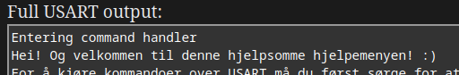
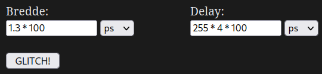

# Innhold
- [Fault Injection: Hva, hvem, hvor, hvorfor, hvordan](README.md#fault-injection-hva-hvem-hvor-hvorfor-hvordan)
  - [Hva er Voltage Fault Injection](README.md#hva-er-voltage-fault-injection)
  - [Hvem bruker Fault Injection](README.md#hvem-bruker-fault-injection)
  - [Hvor bruker man Fault Injection](README.md#hvor-bruker-man-fault-injection)
  - [Hvorfor bruke Fault Injection](README.md#hvorfor-bruke-fault-injection)
  - [Hvordan utføre Voltage Fault Injection](README.md#hvordan-utføre-voltage-fault-injection)
      - [Overordnet](README.md#overordnet)
      - [Konkret eksempel](README.md#konkret-eksempel)
      - [Hvordan finne passende parametre](README.md#hvordan-finne-passende-parametre)
- [Bruk av laben](README.md#bruk-av-laben)
- [Firmware reversing](README.md#firmware-reversing)
- [HMS](README.md#hms)
  - [For laben sin del](README.md#for-laben-sin-del)
  - [For din egen del](README.md#for-din-egen-del)
- [Øvrig lesing](README.md#øvrig-lesing)

# Fault Injection: Hva, hvem, hvor, hvorfor, hvordan

Software inneholder i dag mange robuste sikkerhetsmekanismer som
vanskeliggjør hackerier, datasnokoskopi og algoritmesjonglering.
Heldigvis har vi et ess i ermet; sikkerhetsmekanismer i software
fungerer *kun* så lenge hardwaren er til å stole på\! Og det er her
fault injection kommer inn\! 

Fault injection vil grovt sett si å
*aktivt* introdusere feil i et kjørende system i håp om å få hardwaren
til å oppføre seg annerledes enn tiltenkt. Vi sier da at hardwaren
"glitcher", og dette brukes også ofte som et verb; "å glitche" er altså
da det samme som "å fault injecte", eller "å aktivt introdusere feil i
et kjørende system i håp om å få hardwaren til å oppføre seg annerledes
enn tiltenkt". 

Det finnes mange måter å glitche på, men her i
Kriminalvpolitisentralens remote fault injection lab har vi i dag kun
støtte for "voltage fault injection". For øvrige glitchemetoder må vi
dessverre møte opp på kontoret enn så lenge ¯\\\_(ツ)\_/¯

## Hva er Voltage Fault Injection

Voltage fault injection er en tilnærming som innebærer å bevisst
forstyrre spenningsforsyningen til et system. Ofte vil dette i praksis
være å kutte strømtilførselen til en mikrokontroller et kort øyeblikk
for å introdusere glitcher, men det er også mulig å introdusere glitcher
ved å gi for *høy* spenning i korte øyeblikk. 

Laboppsettet dere har fått
tilgang til i dag er satt opp til å kutte strømtilførselen til
mikrokontrolleren i et angitt tidsrom. Hva, hvis noe, en brikke er
sårbar for må man nesten bare eksperimentere med for å finne ut av, men
vi har allerede bekreftet at NISSE32-brikkene er sårbare mot denne typen
angrep.

## Hvem bruker Fault Injection

Du.

## Hvor bruker man Fault Injection

(Opprinnelig pekte denne til labben, men dette er ikke relevant når vi kun har
hjelp-siden)

## Hvorfor bruke Fault Injection

Fault injection bruker vi for å angripe software *via* hardware. Sagt på
en annen måte: et system som er 100% sikkert i software kan fortsatt (av
og til) knekkes via angrep mot hardware. 

Den *observerte effekten* av
slike angrep vil typisk være ***at brikken hopper over instruksjoner***,
slik at disse ikke kjøres. Tenk deg for eksempel at du har en kodesnutt
som ser slik ut:

    if (user.type == ADMIN):
        go_to_admin_panel()
    else: go_to_lame_normal_user_panel()

Det hadde vært ganske kult om du kunne hoppet over sammenligningen
mellom `user.type` og `ADMIN` eller? Enig\!

## Hvordan utføre Voltage Fault Injection

Voltage fault injection krever presisjon og spesialisert utstyr. Her i
KRIAPOS har vi begge deler, så du kan bare lene deg tilbake med
kaffekoppen fra gjemmekontoret og bruke laben remote.

### Overordnet

Den grunnleggende arbeidsmetodikken består av reverse engineering av
softwaren som kjører på systemet for å finne passende steder å glitche.
Dette er ofte bootloadere, bootROM, firmware og lignende, men kan like
gjerne være mer ordinær software. 

Vi ønsker da å se etter områder i
software hvor det å hoppe over en instruksjon kan virke til vår fordel.
Typiske områder som kan være interessante vil være kontrollstrukturer
som **if-setninger** og **løkker**, og vi kan bruke verktøy som for
eksempel [Ghidra](https://ghidra-sre.org/) til å finne slike områder.

Deretter må vi finne riktige *parametere* som lar oss faktisk treffe
disse områdene med glitchen vår, men mer om det senere.

### Konkret eksempel

La oss ta for oss et oppdiktet eksempel. La oss si at den følgende
pseudokoden ender i at variablen `result` blir noe annet enn 0 under
kjøring, og dermed treffer vi `lose()` funksjonen:

    result = check(some_variable)
    if result == 0:
        win()
    else:
        lose()
    return

Vi vil jo selvfølgelig treffe `win()` i stedet, og dette ser ut som et
sted som kanskje kan fungere for fault injection. Her er det dog viktig
å huske på at mikrokontrolleren ikke jobber med kildekode, men med
maskinkode\! Vi må altså se på selve assembly-koden for å kunne bekrefte
at dette stedet vil fungere, men vi kan selvsagt se på dekompilert kode
i Ghidra og lignende mens vi bare leter grovt etter potensielle punkter.

Mange mikrokontrollere, inkludert NISSE32, bruker ARM
instruksjonssettet, som er litt annerledes enn det vi typisk ser i
programmer til en vanlig PC. Om du ikke er kjent med ARM, eller noe
annet instruksjonssett for den saks skyld, er heldigvis
[ChatGPT](https://chat.openai.com) mer enn villig til å hjelpe, om ikke
kollegaene våre på discord er spesielt pratsomme. 

Den kompilerte
varianten av koden ovenfor kan kanskje se noe sånn ut i ARM
pseudoassembly:

    0x1000: ldr     r1, [r2]
    0x1004: bl      check()
    0x1008: cmp     r0, #0
    0x100c: bne     #0x1018
    0x1010: bl      win()
    0x1014: b       #0x1022
    0x1018: bl      lose()
    0x1022: pop     {pc}

På addresse `0x1000` lastes `some_variable` inn i *registeret* `r1` fra et
annet register, `r2`, før `check()` funksjonen kalles på addresse
`0x1004`. 

Når vi har kommet tilbake fra `check()`-funksjonen igjen skjer
selve sammenligningen i if-testen på addresse `0x1008`, hvor verdien i
*registeret* `r0` sammenlignes med den statiske verdien `0`. Merk at det
er ganske typisk (men ikke 100% garantert) at returverdier fra
funksjoner lagres i registeret `r0` i ARM. 

Så skjer selve "avgjørelsen"
om hvilken vei vi skal ta i if-testen på addresse `0x100c`, **og her er
den viktigste delen\!** Som vi kan se vil branchen ("hoppet") skje til
`lose()`-funksjonen, mens instruksjonen som kommer rett etterpå tar oss
rett til `win()`. Altså hvis vi klarer å glitche slik at vi hopper over
instruksjonen på `0x100c` vil vi være i mål\! 

På `0x1010` kalles
`win()`-funksjonen, men som nevnt er ikke det normaltilstanden i vårt
eksempel. Det er hit vi ønsker å jukse oss frem til, for eksempel ved å
hoppe over instruksjonen rett før. 

Om programmet derimot får kjøre som
vanlig vil vi branche til addresse `0x1018`, og vi vil få en `lose()` midt
i fleisen\! 

Til slutt vil vi bli tatt til addresse `0x1022` hvor vi bare
returner fra funksjonen vi er i, om det så er direkte fra `lose()`,
eller etter `win()` via branchen på addresse `0x1014`.

#### Identifiserte muligheter

Her har vi altså identifisert *minst* én addresse som trolig vil fungere
å glitche på for å treffe `win()`-funksjonen; `0x100c`. Merk dog at det
også er flere andre addresser som *kan* fungere her: 

Hvis vi glitcher på
`0x1008` vil branchen på `0x100c` være avhengig av *forrige gang* en
operasjon påvirket "zero flag"et (forrige gang en "cmp" instruksjon ble
kjørt for eksempel). 

Hvis vi glitcher på `0x1004` vil resultatet av
sammenligningen på `0x1008` avhenge av hva som ligger i `r0` registeret
fra før av. 

Hvis vi glitcher på `0x1000` kan det hende at det som ligger i
`r1` fra før av også vil endre utfallet av `check()`-funksjonen, og få
den til å returnere 0. 

Det finnes også trolig flere addresser *inne i*
`check()`-funksjonen som vil få funksjonen til å returnere 0. 

Og så
videre, og så videre. Å glitche på `0x100c` virker veldig lovende her,
mens andre addresser i umiddelbar nærhet *kanskje også* funker. Dette er
et ganske godt utgangspunkt for å glitche, da vi typisk ikke klarer å
treffe *akkurat* der vi ønsker hver gang. 

Dette illustrerer også
viktigheten i å ikke *begrense* seg til å kun se etter if-setninger og
lignende. Det finnes veldig mange steder man kan glitche for å lure
sikkerhetsmekanismer i software, så ikke sett grenser for din egen
fantasi. Vær kreativ, prøv, og aldri gi opp. Det gjør jo fryktelig vondt
å tenke, men av og til er det ikke så dumt\!

### Hvordan finne passende parametre

Om du finner ut av dette må du gjerne skrive en doktorgrad om emnet, og
sende den til oss. 

Men fra spøk til alvor; å finne "riktige" parametre
for en glitch er tidkrevende arbeid, og typisk er flaks en ikke-uviktig
del av jobben. Heldigvis har fault injection riggen vår blitt ekstremt
smart og robust, og vil gi deg veldig god hjelp på veien. Se eget
avsnitt om bruk av laben for mer informasjon rundt dette.

#### First things first: Hvilke parametre finnes

De viktigste parameterene når det gjelder voltage glitching hvor vi
kutter strømtilførselen er: *bredden* på glitchen, og *delayen* på
glitchen. 

**Bredden** er angitt i tid, og betyr hvor lenge vi kutter
strømmen til mikrokontrolleren. 

**Delayen** er også angitt i tid, og
betyr hvor lenge etter *triggeren* vi skal vente før vi "fyrer av"
glitchen vår. 

En *trigger* er noe man bruker for å identifisere et kjent
punkt i kode-eksekveringen, og dermed baserer man glitchen sin på den.
Vanligvis vil man gjøre noe sånt som å se på strømforbruket til chipen,
og f.eks identifisere at den har begynt å lese fra flash på grunn av
endret strømforbruk. 

Her i KRIAPOS laben derimot bruker vi julemagi og
vennskap til å identifisere ***nøyaktig*** når mikrokontrolleren er
ferdig med å lese inn en kommando fra USART som triggeren vår, og vi er
ærlig talt litt usikre på hvorfor andre bruker den langt mindre
nøyaktige oscilloskop-metoden...

#### Second things second: Din første glitch

Til å begynne med må vi finne parametre som påvirker chipen i det hele
tatt. Så lenge triggeren er på et sted hvor du vet at det eksekveres
kode (som er tilfellet i dagens laboppsett), kan vi begynne med å sette
delay til 0, og så jobbe med å finne en fungerende bredde først. 

Et godt
utgangspunkt kan være å se på hvor rask klokken til mikrokontrolleren du
angriper er. Ta en titt i databladet for chipen og se hvor mange Hertz
klokken har. En god startverdi kan være en klokkesyklus eller to eller
tre eller fire eller fem, men merk at visse mikrokontrollere kan være
ganske ømfintlige på akkurat hvor bred glitchen skal være, og de bryr
seg typisk ikke så mye om heltall vs desimaltall heller. 

Heldigvis får
man typisk *relativt* god tilbakemelding på forsøkene dine her: hvis du
glitcher for smalt vil du ikke påvirke chipen i det hele tatt, mens hvis
du glitcher for bredt vil chipen som regel enten skru seg av, eller
resette. Juster altså verdien på bredden **opp** hvis programvaren
kjører som normalt helt uten glitch, juster **ned** hvis chipen tryner
*spektakulært*, og la delayen stå som den er om chipen tryner *litt*,
eller du får skippede instruksjoner. 

Når du har funnet en god verdi for
bredden trenger du typisk ikke å tenke på denne mer, og kan bare la den
stå. 

Delay er der selve kunsten i fault injection ligger. Bredden
bestemmer *om* du glitcher, mens delay bestemmer *hvilken instruksjon*
du glitcher. 

Igjen er det lurt å ta utgangspunkt i klokkefrekvensen til
chipen, og eventuelt prøve seg frem litt til du finner ut av omtrentlig
hvor mange klokkesykluser den bruker per instruksjon, om dette ikke er
informasjon du besitter. Dette kan dog være litt vanskelig, ettersom vi
aldri kan være *helt* nøyaktige med glitchen vår. Å glitche flere ganger
med helt like parametre *kan* gi glitcher på ulike steder, men du kan
være rimelig sikker på at du ikke er mer enn 2-3 instruksjoner unna
"normalen" for dine parametre (når du bruker KRIAPOS laben som opererer
med julemagi og vennskap...). 

Det er uansett ikke kritisk å være *helt*
nøyaktig med hvor mange sykluser det går på en instruksjon, men det vil
gjøre det videre arbeidet ditt noe lettere. Når du er relativt fornøyd
med at du klarer å styre glitchen din sånn ca på instruksjonsnivå kan du
gå videre til neste skritt.

#### Third things third: Hvordan glitche *der du vil*

Å få chipen til å skippe instruksjoner i det hele tatt kan være en liten
bragd i seg selv, men det er her moroa begynner. Nå kan du
eksperimentere med ulike delays og se hvilke instruksjoner du skipper,
for så å kryss-referere denne addressen med softwaren som du har åpent i
ditt favoritt reverse engineering-verktøy, være seg at det er Ghidra,
IDA, Binja, r2 (gud hjelpes...) eller ditt eget hjemmesnekrede
shell-script. 

Herfra må du da identifisere hvor i kodeflyten du er, og
massere både delay og hva du sender inn for å få koden, og glitchen, til
å gå dit du vil. Om du klarer å treffe addressen du identifiserte via
kode-analyse, men det ikke hadde effekten du hadde håpet på må du
kanskje ta en ny titt på assemblyen og forsikre deg om at du forstår
koden korrekt. Husk også at det er lov å spørre både ChatGPT og på
discord (innenfor rimelighetens grenser).

# Bruk av laben

Laben gir deg tilgang på flere tekstbokser som viser deg statusen til
ditt forrige angrep, samt kontroller for å styre disse angrepene. To av
disse tekstboksene (hhv. "USART output før glitch" og "Full USART
output") gir deg output fra selve brikken du kommuniserer med. "USART
output før glitch" forteller deg altså all output du allerede har
mottatt i det glitchen inntreffer, mens "Full USART output" gir deg all
informasjonen brikken gav deg under hele kjøringen. 

Den siste
tekstboksen, "Chip status", gir deg informasjon om hvordan brikken
responderte på angrepet. Hvis en glitch lykkes vil denne boksen fortelle
deg nøyaktig hvilken instruksjon som ble hoppet over, og om brikken
eventuelt kræsjet etterpå. 

Under disse statusfeltene har du tilgang på
flere kontroller. En av de viktigste er "USART kommando". Dette er
dataen du sender inn til brikken under et angrep, og er kritisk for å
kunne styre programflyten dit du vil. Om du for eksempel bare vil
kommunisere enkelt med brikken kan du sende kommando slik, med 0 bredde:

Noen få sekunder senere vil riggen vår være ferdig med "angrepet", og
vise deg resultatet i USART tekstboksene:

Under "USART kommando" har vi kontroller for bredde og delay i selve
glitchen. Disse feltene støtter matematiske uttrykk for å gjøre arbeidet
ditt litt enklere. Hvis du for eksempel har kommet frem til at
mikrokontrolleren har en klokkesyklus på 100ps, bruker 4 sykluser per
instruksjon, og du ønsker å glitche etter ca 255 instruksjoner med en
bredde på 1,3 sykluser, kan du sende noe slik:

I dagens angrep har vi allerede satt opp triggeren til å aktivere rett
etter at brikken har lest inn din kommando fra USART, så ta høyde for
dette når du setter delayen din.

# Firmware reversing

Reverse engineering av firmware er i grunn temmelig likt reverse
engineering av hvilken som helst annen software. Det finnes dog noen
ting som det kan være greit å være klar over. 

Software blir typisk
levert i et eksekverbart format som for eksempel EXE eller ELF. Noe av
grunnen til dette er at operativsystemet må vite hvordan programmet skal
lastes inn i minnet, hvilke biblioteker som skal lastes inn hvor og så
videre, og EXE og ELF formatene formidler denne informasjonen. 

I firmware verden derimot har du typisk ikke et operativsystem, og du
jobber da heller ikke mot virtuelle minneaddresser, men fysiske. Det
betyr at chipen bare vil laste koden til et fastsatt minneområde som er
likt hver gang, eller eventuelt bare starte eksekveringen rett fra
flash, igjen fra en fastsatt addresse. 

Firmware leveres derfor typisk
som rene binærfiler i .bin eller .hex format, ettersom informasjonen fra
ELF og EXE headere ikke er nødvendig for kjøring. Av og til finner man
firmware i disse formatene uansett, men det er typisk bare for å
kommunisere informasjon til støtteverktøy om hvor på flash firmwaren
skal skrives, og for å gi informasjon relatert til debugging. 

For å
finne ut av nødvendig informasjon for reverse engineering av firmware,
som baseaddresse og instruksjonssett må du kanskje:

- Lese databladet til chipen

- Få tak i informasjon om bygge-prosessen

- Få tak i en debug-build

- Dedusere informasjon basert på binæren

    - Firmware starter ofte med et "Interrupt Vector Table", eller noe
      tilsvarende, som kan være nyttig for å finne entry point, exception
      handlere og mer

- Ringe en venn

Eller en kombinasjon av disse. 

I tillegg til dette inneholder gjerne firmware mye bruk av tilsynelatende
"magiske" addresser og verdier. Betydningen av disse verdiene finner man gjerne
via de samme kanalene som ovenfor, i tillegg til liberal bruk av utdannede
gjetninger.

# HMS

Laben kan være et farlig sted\! Sett deg **GODT** inn i retningslinjene
under før du begir deg ut på eventyr i elektronikkens magiske verden\!

## For laben sin del

Du må *alltid* huske på at du **ikke** må glemme at du aldri skal ha sko
som *ikke* er ***anti-ESD*** sikrede når du går inn på laben
(ikke-remote only).

## For din egen del

Ikke ta på ting som...

  - Gnister
  - Blinker
  - Plinger
  - Planger
  - Blipper
  - Blopper

...vet du hva? Bare ikke ta på noe du.

# Øvrig lesing

  - [The Hardware Hacking Handbook](https://www.hardwarehacking.io/)
  - [Synacktiv - How to voltage fault injection](https://www.synacktiv.com/en/publications/how-to-voltage-fault-injection)
  - [Raelize blog](https://raelize.com/blog/)

